学习如何设计和开展有人类参与者参与的实验，是所有人机交互研究人员必须掌握的技能。在本章中，我将介绍设计和开展人机交互实验的核心细节。

思考实验设计的一种方法是信号与噪声隐喻。在这个隐喻中，我们将观察和测量结果分为两个部分：信号和噪音。（见图 5.1）信号源显示的是时间序列。一个轻微的上升趋势显而易见；然而，信号源中的变异性或噪音使其难以被发现。 难以察觉。如果我们将信号源分为信号和噪声两个部分、信号的趋势就很明显。

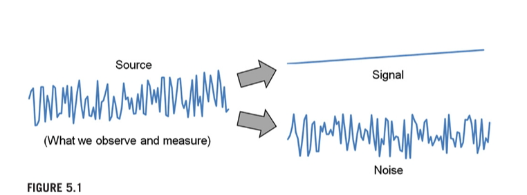

在人机交互实验中，信号与感兴趣的变量有关，如输入设备、反馈模式或正在研究的交互技术。噪音则是其他一切随机影响因素。其中包括温度、照明、背景噪音、摇晃的椅子或电脑屏幕上的眩光等环境因素。实验中的人或参与者也是噪音或可变性的来源。有些参与者今天可能心情很好，而有些参与者则心情不好。有些人有某种行为倾向，而有些人的行为则不同。设计实验的过程就是在增强信号的同时减少噪音的过程。要做到这一点，就要仔细考虑实验的设置，包括操纵和测量的变量、控制的变量、程序、任务等。

## 5.1 What methodology?

方法或方法论是指设计和开展实验的方式。这包括确定人员（参与者）、硬件和软件（材料或仪器）、任务、任务顺序、向参与者介绍情况和让其做好准备的程序、变量、收集和分析的数据等。拥有一套完善的方法至关重要。在这一点上，艾伦-纽厄尔毫不犹豫： "科学就是方法。其他一切都是评论"。

这些话都很有力。为什么纽厄尔要对科学这样一个广泛的话题使用如此有力而又狭隘的语言呢？原因在于纽厄尔和其他人都明白，方法论是科学的基石。如果方法论薄弱或有缺陷，科学就无从谈起。剩下的只能是评论。

在前一章中，我主张使用标准化方法来加强实验研究。另一方面，临时或杜撰的方法会削弱研究。仅仅因为某个方法似乎是测试或展示一个想法的好方法，并不意味着我们应该刻意设计一个方法。那么，对于人机交互研究来说，适当的方法是什么呢？接下来的讨论仅涉及实验研究，特别是因子实验，参与者在其中暴露于因素水平（测试条件），而其行为（人类表现）被观察和测量。总的来说，这种方法主要来自人机交互的母学科之一：实验心理学。

正如计算机协会（ACM）是管理计算机科学和人机交互等相关特殊领域的主要组织一样，美国心理学会（APA）也是管理实验心理学的主要组织。其《美国心理学会出版手册》于 1929 年首次出版，是从事涉及人类参与者的实验研究的研究人员的宝贵资源（APA，2010 年）。该手册现已出到第六版，被 1000 多种期刊采用，涉及多个学科（Belia, Fidler, Williams, and Cumming, 2005）。其中包括人机交互期刊。ACM的《Transactions on Computer-Human Interaction (TOCHI) 》（ACM，2012）和Taylor and Francis的《Human-Computer Interaction》（Taylor and Francis，2012）等期刊都推荐使用APA指南。APA 出版手册》不仅涉及出版风格；手册还规定了许多方法论问题，例如自变量和因变量的命名和引用、招募参与者、报告统计测试结果等。此外，标题也体现了研究与出版之间的重要联系。

心理学家戴维-马丁（David Martin）的《心理学实验》（Doing Psychology Experiments）是另一种资源，现在已经出到了第六版（D. W. Martin，2004 年）。马丁的方法令人耳目一新，寓教于乐，与其说是学术著作，不如说是食谱。所有的核心细节都一应俱全，并附有寓教于乐的实例。

ACM SIGCHI 年度会议（CHI）的论文集也是极好的资源。从 ACM 数字图书馆可以轻松查看和下载 CHI 论文。当然，CHI 论文集中的许多研究论文并不介绍实验研究。这很好。人机交互是多学科的。研究人与技术交互的方法也同样多种多样。然而，在那些进行了用户研究--以人类参与者为对象的实验--的论文中，不幸的是，有许多论文的研究方法是临时性的。在试图理解一个新的、可能很有趣的想法的同时，还要研究一种不熟悉的方法，这种额外的负担使得研究这些论文变得很困难。不过，也有很多CHI论文坚持使用标准方法进行人体实验。

要发现这样的例子相对容易。如果论文中有一节名为 "方法 "或 "方法论"，其中第一个小节名为 "参与者"，那么该论文及其描述的研究很有可能遵循了本章规定的实验研究标准。CHI 论文集中的例子如下： Aula, Khan, and Guan, 2010; Chin and Fu, 2010; Chin, Fu, and Kannampallil, 2009; Duggan and Payne, 2008; Gajos, Wobbrock, and Weld, 2008; Kammerer, Nairn, Pirolli, and Chi, 2009; Majaranta, Ahola, and Špakov, 2009; Räihä and Špakov, 2009; Sjölie et al、 2010；Sun、Zhang、Wiedenbeck 和 Chintakovid，2006；Tohidi 等人，2006；Wobbrock 等人，2009。

## 5.2 Ethics approval

在设计每个 HCI 实验之前，一个关键步骤是伦理批准。由于人机交互研究涉及人类，“研究人员必须尊重人类研究参与者的安全、福利和尊严，并平等、公平地对待他们。2 审批程序由监督研究的机构或资助机构管理。在作者所在的机构，研究项目必须得到人类参与者审查委员会 （HRPC） 的批准。其他常用的委员会名称包括机构审查委员会 （IRB）、伦理审查委员会 （ERC） 等。 ...

通常，审查委员会的职责是确保遵守一系列伦理准则。其中包括告知参与者以下权利。

+ 研究的性质（假设、目的和目标等）

+ 研究方法（如医疗程序、问卷调查、参与观察等）

+ 任何风险或益处

+ 有权不参与、不回答任何问题和/或随时终止参与而不受损害（如不受学业惩罚、撤销报酬等）。

+ 匿名和保密的权利

具体细节将根据当地的指导原则而有所不同。通常会特别关注易受伤害的参与者，如孕妇、儿童或老人。在涉及人类参与者的情况下，批准研究的依据是在参与者面临的风险与社会效益之间取得平衡。

## 5.3 Experiment design

实验设计是将测试用户界面或交互技术假设所需的所有环节整合在一起的过程。它包括决定和定义使用哪些变量、使用哪些任务和程序、使用多少参与者以及如何招募参与者等等。

设计 HCI 实验最困难的步骤之一就是刚刚开始。关于新界面或交互技术的想法早在做实验的想法之前就已经形成。甚至可能有一个现有的原型来实现一个研究想法。也许目前还没有原型。无论如何，有一个关于界面或交互技术的想法，它看起来很新颖和有趣。做一个实验来测试这个想法似乎是个好主意，但从开发一个新想法的创造性和令人兴奋的工作过渡到做实验的有点机械和世俗的工作是很困难的。这里有一个问题，在开始和运行HCI实验时，它比其他任何问题都更集中注意力：实验变量是什么？

这似乎是一个奇怪的起点。毕竟，实验变量与迄今为止投入的创造性努力相去甚远。嗯，不是真的。思考实验变量是一个很好的练习。原因如下。这个过程迫使我们从善意的、宽泛的但不可测试的问题（例如，我的想法有什么好处吗？）过渡到更狭窄但可测试的问题（例如，使用我的新界面可以比使用现有界面更快地执行任务吗？）。如有必要，请查看上一章中关于研究问题以及内部和外部有效性的讨论。

对实验变量的思考迫使我们设计狭隘且可测试的问题。两个最重要的实验变量是自变量和因变量。事实上，这些变量都可以在上一段的示例问题中找到。像“更快”或“更少的步骤”这样的表达抓住了因变量的本质：被测量的人类行为。表达式“使用我的新接口而不是使用现有接口”抓住了自变量的本质：与替代接口进行比较的接口。事实上，一个可检验的研究问题本质上表达了自变量和因变量之间的关系。让我们更详细地检查这两个变量

##  5.4 Independent variables

自变量是一种情况或特征，i自变量是一种情况或特征，在用户与计算机交互时，它纵或系统地控制以改变人类的反应。自变量也称为因子。使用自变量设计的实验通常称为因子实验。变量在环境或特征的多个（至少两个）级别上进行操作。该变量是“独立”的，因为它独立于参与者的行为，这意味着参与者无法做任何事情来影响自变量。在用户与计算机交互时，操纵或系统地控制人类反应的变化。自变量也称为因子。使用自变量设计的实验通常称为因子实验。变量在环境或特征的多个（至少两个）级别上进行操作。该变量是“独立”的，因为它独立于参与者的行为，这意味着参与者无法做任何事情来影响自变量。

操作的变量通常是标称尺度属性，通常与接口的属性相关。查看任何介绍因子实验的 HCI 研究论文，很容易找到自变量的示例。它们是任何可能影响用户使用计算机系统熟练程度的东西。示例包括设备（具有水平鼠标、轨迹球和手写笔）（MacKenzie、Sellen 和 Buxton，1991 年）、反馈模式（具有听觉、视觉和触觉水平）（Akamatsu 等人，1995 年）、显示尺寸（具有大大小小的级别）（Dillon、Richardson 和 Mcknight，1990 年）、显示类型（具有 CRT 和 LCD 级别）（MacKenzie 和 Riddersma，1994 年）、交叉显示技术（使用级别拼接、鼠标乙醚、 和以太 + 晕）（Nacenta、Regan、Mandry 和 Gutwin，2008 年）、传递函数（具有恒定增益和指针加速度）（Casiez、Vogel、Pan 和 Chaillou，2007 年）、树可视化（具有传统、列表和多列级别）（Song、Kim、Lee 和 Seo，2010 年）和导航技术（使用标准平移和缩放级别与 PolyZoom）（Javed、Ghani 和 Elmqvist，2012 年）。这些变量易于操作，因为它们是设备（即计算机或软件）的属性。“操纵”的概念仅指作为实验过程的一部分，系统地向参与者提供一个接口，然后是另一个接口。

但是，除了计算机系统的属性之外，自变量还可以是很多东西。它可以是人类的特征，例如年龄（Chin and Fu， 2010;Chin et al.， 2009）、性别（男性、女性）（Sun et al.， 2006;Zanbaka、Goolkasian 和 Hodges，2006 年）、惯用手（左撇子、右撇子）（Kabbash 等人，1993 年;Peters 和 Ivanoff，1999 年）、评估网页的专业知识（专家、新手）（Brajnik、Yesilada 和 Harper，2011 年）、身体姿势（站立、坐着、走路）、首选操作系统（Windows、Mac OS、Linux）、第一语言（例如，英语、法语、中文）、政治观点（左、右）、宗教观点、最高教育水平、收入、身高、体重、头发颜色、鞋码等。目前尚不清楚这些人类特征是否必然与人机交互有关，但谁知道呢。

请注意，性别或第一语言等人类特征是自然发生的属性。尽管这些属性是合法的自变量，但它们不能像接口的属性一样被“操纵”。

自变量也可以是环境环境，例如背景噪音（安静、嘈杂）、房间照明（太阳、白炽灯、荧光灯）、振动水平（平静、在汽车中、在火车中）等

这里有两个提示需要考虑。首先，在制定自变量时，既要根据情况或特征本身来表达，也要根据选择用于测试的环境或特征的水平来表达它。（自变量的水平通常称为测试条件。因此，我们可能有一个称为交互姿势的自变量，其水平为坐、站和走。这似乎是一个奇怪的点;然而，在阅读 HCI 研究论文时，令人惊讶的是，自变量通常没有明确命名。例如，如果一个实验试图确定使用音频反馈和触觉反馈是否能更好地执行某个 PDA 任务，那么单独命名自变量（例如，反馈模式）和级别（音频，触觉）是很重要的。

第二个技巧与第一个技巧有关：一旦确定了自变量的名称和水平的名称，就在整个论文中始终坚持使用这些术语。这些术语在实验中具有特殊的含义，任何形式的偏差都可能使读者感到困惑。切换到交互位置（参见交互姿势）、直立（参见站立）、声音（参见音频）或振动（参见触觉）等术语可能会造成混淆。这是一个小的、吹毛求疵的问题吗？不。有时，在研究论文中跟踪讨论是一件很困难的事情。错误往往在于写作，而不是一个人遵循或理解的能力。研究人员有责任写下他或她的工作结果，以尽可能清晰的方式提供基本原理、方法、结果、讨论和结论。用直截了当、一致和简洁的声音写作怎么强调都不为过。第 8 章详细阐述了为清晰起见而写作的更多技巧。

尽管使用单个自变量设计和进行 HCI 实验是合理的，但实验通常具有多个自变量。由于在设计和执行实验方面投入了大量工作，因此倾向于尽可能多地包含自变量，以便提出更多的研究问题，并可能得到回答。但是，包含太多变量可能会影响整个实验。每增加一个自变量，变量之间就会存在更多的效应。图 5.2 进行了说明。

具有单个自变量的设计包括主效应，但没有交互效应。具有两个自变量的设计包括两个主效应和一个交互效应，总共有三个效应。交互作用效应是双向交互作用，因为它是在两个自变量之间。例如，具有自变量 Device 和 Task 的实验包括 Device 和 Task 的主效应以及 Device × Task 交互效应。提醒一下，影响在于因变量。交互效应的解释在第 6 章假设检验中讨论。

一旦引入第三个自变量，情况就会恶化：有七个效应！对于 4 个和 5 个自变量，分别有 14 个和 25 个效应。变数太多了！在有这么多影响的情况下，很难找到对所有影响的有意义的解释。此外，每个自变量都会增加人类反应的可变性，因此如果包含太多变量，所有变量都可能丢失。三向或更高的交互效应极难解释，最好避免。因此，一个好的设计是将自变量的数量限制为一两个，最多三个。

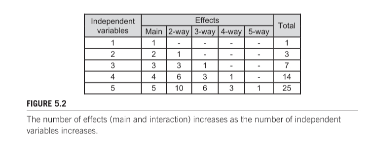

## 5.5 Dependent variables

因变量是衡量的人类行为。在 HCI 中，最常见的因变量与速度和准确性有关，速度通常以倒数形式报告，即时间——任务完成时间。准确性通常报告为正确或错误执行的试验或其他操作的百分比。在后一种情况下，准确性称为错误或错误率。因变量中的因变量是指变量依赖于人类。测量值取决于参与者的行为。例如，如果因变量是任务完成时间，那么很明显，测量值高度依赖于参与者的行为。

除了速度和准确性之外，HCI 实验中还使用了无数其他因变量。其他包括准备时间、动作时间、吞吐量、视线移动、鼠标到键盘的手部转换、退格键、目标重新输入、重试、关键动作、视线移动、摇摆等。可能性是无限的。

现在，如果你想知道“wobduls”，那么你可能正在关注讨论。那么什么是wobdul？嗯，没什么，真的。这只是一个虚构的词。提到它只是为了强调因变量中的一些重要内容：人类行为的任何可观察、可测量的方面都是潜在的因变量。如果该行为能够区分两个测试条件之间的性能，从而可能揭示一个条件相对于另一个条件的优势或劣势，那么它就是一个合法的因变量。因此，当涉及到因变量时，“滚动你自己”是可以接受的。当然，必须明确定义所有因变量，以确保研究可以重复。

Duh等人（2008）在对三款用于游戏的手机进行比较评估时定义的“负面面部表情”是新因变量的一个例子。参与者在不同的手机上玩游戏被录像。对录像带进行了测试后分析，以计算负面面部表情，如皱眉、困惑、沮丧和摇头。在方差分析中输入计数，以确定参与者是否对任何界面有不同程度的困难。

另一个示例是“读取文本事件”。在使用眼动仪进行文本输入（眼动打字）的系统试点测试中，观察到用户经常将视线从屏幕键盘转移到键入的文本上，以监控他们的进度（Majaranta 等人，2006 年）。此外，有一种感觉是，这种行为在其中一个测试条件下尤为突出。因此，RTE（读取文本事件）被定义并用作因变量。同一项研究还使用“重新聚焦事件”（RFE）作为因变量。RFE 被定义为参与者重新聚焦于某个键以选择它的次数。

除非人们正在调查手机游戏或眼睛打字，否则负面面部表情、阅读文本事件或重新聚焦事件不太可能被用作因变量。提到它们只是为了强调定义、测量和分析任何可能暴露所研究的界面或交互技术差异的人类行为的优点。

与自变量一样，将变量与其单位分开命名通常会有帮助。例如，在文字录入实验中，可能有一个因变量叫文字录入速度，单位是 "字/分钟"。有关计算机指向设备的实验通常使用菲茨定律范式进行测试。因变量通常称为吞吐量，单位为 "比特/秒"。最常见的因变量是任务完成时间，单位为 "秒 "或 "毫秒"。如果测量是对事件的简单计数，则没有单位坚持。

在构建因变量时，重要的是要考虑如何收集测量值以及收集、组织和存储数据。最有效的方法是设计实验软件，根据时间戳、按键或其他可通过软件事件检测到的交互来收集测量结果。数据的组织和存储方式应便于后续分析。图 5.3 显示了文本输入实验的示例。有两个数据文件。第一个包含时间戳和按键，而第二个总结了完整短语的输入，每个短语一行。

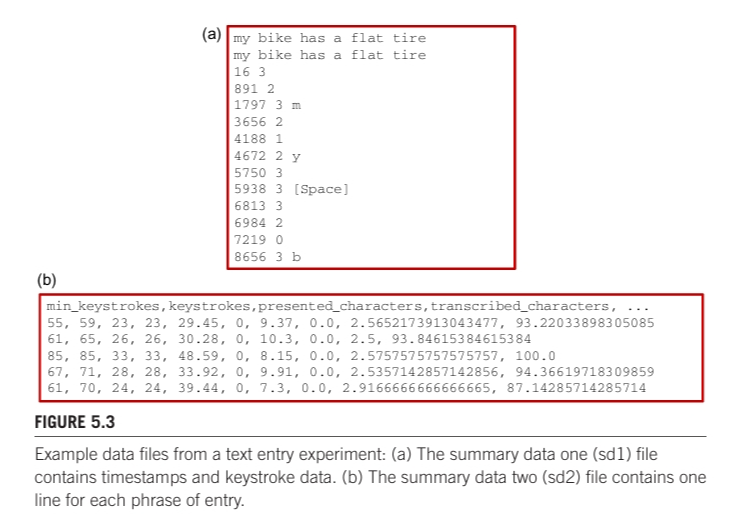

图 5.3 中的数据文件是通过实现用户界面或交互技术的软件创建的。试点测试至关重要。通常，试点测试被认为是对用户界面的粗略测试，并添加了修改以使交互正确。这是真的。但是，试点测试对于确保收集的数据正确且以适当的格式用于后续分析也很重要。因此，对实验软件进行试点测试，并对收集到的数据进行初步分析。电子表格应用程序通常就足够了。

为了便于后续分析，数据还应包括用于识别参与者和测试条件的代码。通常，此信息包含在数据或文件名中的其他列中。例如，图 5.3a 中数据的文件名是 TextInputHuffman-P01-D99-B06-S01.sd1，用于标识实验 （TextInputHuffman）、参与者 （P01）、设备 （D99）、块 （B06） 和会话 （S01）。后缀为“sd1”，表示“摘要数据一”。请注意，图 5.3b 中的 sd2 文件是逗号分隔的，以便于导入，并包含一个标题行，用于标识下面每列中的数据。

如果使用商业产品进行实验，通常无法通过定制实验软件收集数据。参与者是在外部观察的，而不是通过软件观察的。在这种情况下，数据收集是有问题的，需要一种创造性的方法。方法包括实验者手动计时，使用日志表和铅笔记录事件，或在进入过程中拍摄交互的照片或屏幕快照。例如，如果试验结束时的显示屏上显示结果，则照片很有用。录像是另一种选择，但对视频数据的后续分析非常耗时。Noldus（www.noldus.com）等公司提供完整的系统，用于录像互动和执行事后时间线分析

## 5.6 Other variables

除了自变量和因变量外，还有其他三个变量：控制变量、随机变量和混杂变量。这些受到的关注要少得多，在研究论文中很少被提及。然而，了解每个对于实验研究都很重要。

###  5.6.1 Control variables

有许多情况或因素 （a） 可能会影响因变量，但 （b） 尚未得到调查。这些需要以某种方式得到满足。一种方法是控制它们——将它们视为控制变量。示例包括室内照明、室温、背景噪音、显示器大小、鼠标形状、鼠标光标速度、键盘角度、椅子高度等。大多数情况下，研究人员不会考虑这些条件。但它们存在，它们可能会影响因变量。控制它们意味着它们在实验期间固定在标称设置，因此它们不会干扰。但是，如果设置为极值，它们可能会受到干扰。如果背景噪音水平非常高或房间太冷，这些因素可能会影响结果。允许这种情况以固定的名义值存在是实验研究中的典型特征。这些情况被视为控制变量。

有时需要控制参与者的特征。界面的类型或研究目标可能需要测试具有某些属性的参与者，例如，右撇子参与者、视力为 20/20 的参与者或具有特定经验的参与者。拥有大量控制变量可以减少测量行为的可变性，但会产生不太可推广的结果。

###  5.6.2 Random variables

与其控制所有情况或因素，不如允许某些情况或因素随机变化。这种情况是随机变量。由于在措施中引入了更多的可变性，因此存在成本，但由于结果更具普遍性，因此存在好处。

通常，随机变量与参与者的特征有关，包括生物特征（例如，身高、体重、手的大小、握力）、社交倾向（例如，尽责、放松、紧张），甚至遗传（例如，性别、智商）。通常，这些特征是允许随机变化的。

在继续之前，值得总结一下上面提到的控制变量和随机变量的权衡。最好将比较与内部效度和外部效度的实验特性相对照，正如前一章所讨论的那样。图 5.4 展示了这种权衡。

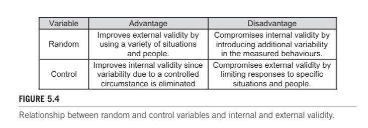

### 5.6.3 Confounding variables

任何随自变量系统变化的情况或条件都是混杂变量。与对照变量或随机变量不同，混杂变量在实验研究中通常是有问题的。观察到的效应是由自变量还是混杂变量引起的？研究人员必须调整可能存在的混杂变量，并消除它，调整它，或以某种方式考虑它。否则，观察到的效果可能会被错误地解释

例如，考虑一个实验，该实验旨在确定相机距离是否对人类表现有影响，使用眼动仪进行计算机控制。在实验中，相机距离（自变量）有两个级别，即近距离和远距离。对于近处条件，小型摄像头 （A） 安装在连接到用户眼镜的支架上。对于远距离条件，使用昂贵的眼动追踪系统，将摄像头（B）放置在系统显示屏上方。在这里，相机是一个混杂变量，因为它在自变量的水平上系统地变化：相机 A 表示近条件，相机 B 表示远条件。如果实验显示相机距离对人类表现有显著影响，则该效应可能与相机距离无关。

或许效果仅仅是使用一台摄像机来拍摄近距离条件，另一台摄像机来拍摄远距离条件的结果。为了避免混淆，我们在近距离和远距离条件下都使用相同的摄像机（和相同的系统）。另一种可能性是简单地重新命名自变量。新的名称可以是“设置”，包括“近距离设置”和“远距离设置”两个层次。这些新标签承认自变量涵盖了界面的多个方面，例如摄像机距离、摄像机和系统。这种区分之所以重要，不仅仅是为了确保结论准确地反映不同设置，而不仅仅是摄像机距离。

在菲茨定律实验中有时会发现混杂变量。大多数菲茨定律实验使用以运动幅度 （A） 和目标宽度 （W） 为自变量的目标选择任务。菲茨的原始实验就是一个典型的例子。他使用手写笔敲击任务，每个级别有四个级别，分别用于移动幅度（A = 0.25、0.5、1.0 和 2.0 英寸）和目标宽度（W = 2、4、8 和 16 英寸）（Fitts，1954 年）。他通过与信息论和电子通信的类比，认为A和W分别像信号和噪声，每个任务都以比特为单位携带信息。他提出了一个难度指数（ID）作为任务信息内容的比特度：ID = log2（2A/W）。

尽管大多数Fitts定律实验将A和W视为自变量，但有时A和ID被视为自变量（例如，Gan和Hoffmann，1988）。请考虑图 5.5a 中的示例。有两个自变量，A 的级别为 4、8、16 和 32 cm，ID 的级别为 1、2、3 和 4 位，产生 4 × 4 = 16 个测试条件（图中的阴影/黄色单元格）。为了实现每个 A 的必要 ID，目标宽度必须有所不同。例如，左上角的单元格需要 W = 2A/2ID = （2 × 16）/21 = 16 cm。图 5.5b 中添加了每个条件的目标宽度。你看到混淆了吗？随着 ID 的增加，W 减小。目标宽度 （W） 是一个混杂变量。如果实验揭示了 ID 的显着影响，则该效应是由 ID 还是 W？5 为了进一步说明，图 5.5c 显示了相同的设计，但通过运动幅度 （A） 和目标宽度 （W） 揭示了条件。

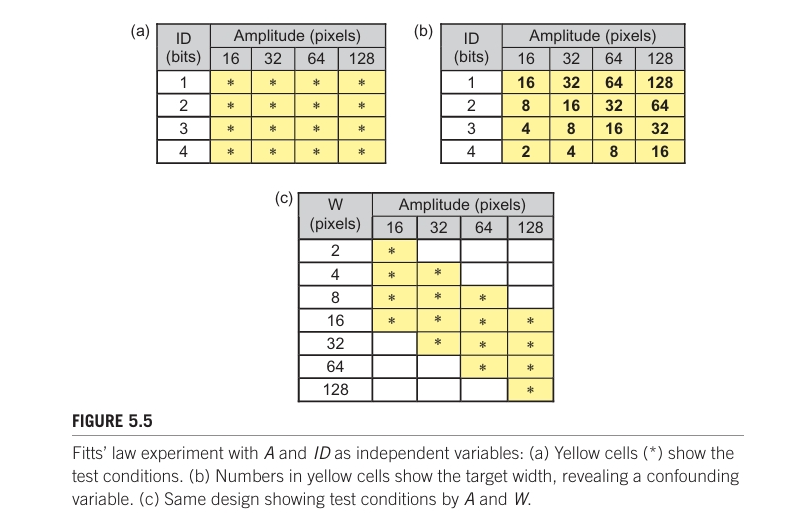

再举一个例子，将“交互技术”作为具有三个水平（A、B 和 C）的自变量的实验。 进一步假设有 12 名参与者，并且所有人都在 A 上进行了测试，然后是 B，然后是 C。 显然，由于练习，性能可能会提高。在这种情况下，实践是一个混杂变量，因为它会随着交互技术而系统地变化。参与者对 A 进行了少量练习，对 B 进行了更多练习，对 C 进行了更多练习。如果性能对 C 来说是最好的，那么可以得出结论 C 比 A 或 B 更好。然而，也许表现更好，仅仅是因为参与者在测试C之前从A和B的练习中受益。将练习作为混杂变量的一种方法是平衡向参与者呈现测试条件的顺序（见第 5.11 节）。

这是另一个例子：比较了两个搜索引擎界面，谷歌和“新”。如果所有参与者都有使用 Google 的经验，但没有使用新界面的经验，那么以前的经验就是一个混淆变量。这可能是不可避免的，因为很难找到没有谷歌搜索引擎经验的参与者。只要注意到并承认先前经验的影响，那么这不是问题。当然，这种影响可能是由于混淆造成的，而不是由于测试条件造成的。

在文本输入实验中可能会出现类似的混淆，例如，将新的键盘布局与 Qwerty 布局进行比较。公平的比较需要参与者对两种布局具有相同的经验水平。但是，当然很难找到不熟悉 Qwerty布局的参与者。因此，Qwerty 布局肯定会具有优势，至少在最初是这样。在这种情况下，值得考虑纵向设计，其中在很长一段时间内比较布局，以查看新的键盘布局是否有潜力通过练习克服 Qwerty

## 5.7 Task and procedure

让我们重新审视自变量的定义：“在用户与计算机交互时，纵或系统控制以引起人类反应变化的情况或特征。强调是为了“引起人类反应的变化”。当参与者被给予测试条件时，他们被要求在测量他们的表现时完成一项任务。之后，他们被赋予不同的测试条件（自变量的另一个级别），并要求他们再次执行任务。显然，任务的选择很重要。

设计一个良好的任务有两个目标：代表和区分。一个好的任务应该代表人们在界面上所做的活动。与实际或预期使用类似的任务将提高研究的外部效度——即将结果推广到其他人和其他情境的能力。一个好的任务还应该能够区分测试条件。显然，互动中存在着能够区分测试条件的因素，否则就没有研究可进行。一个好的任务必须关注不同之处，以引发在测试条件之间暴露出的行为反应，从而揭示出测试条件之间的优点或问题。这应该体现为在测试条件之间测量的反应中的差异。如果界面或互动技术在任务执行方式上足够不同，那么就可能出现差异。

通常，任务的选择是不言而喻的。如果研究思路是在电子表格中插入函数的图形方法，那么一个好的任务是将函数插入到电子表格中——使用图形方法而不是传统的键入方法。如果研究思路是在对 GPS 设备进行编程时的听觉反馈技术，那么一个好的任务是在 GPS 设备中对目的地进行编程——借助听觉反馈与视觉反馈

使任务代表实际使用情况将提高外部有效性，但也有缺点。任务的代表性越强，任务就越有可能包含与被测接口或交互方法没有直接关系的行为。此类行为可能会损害任务区分测试条件的能力。这没有什么险恶的。它只是反映了人类在使用计算机时开展业务的复杂方式。当我们输入文本时，我们也会考虑要输入什么。我们可能会停下来，思考，输入一些东西，再想一想，改变主意，删除一些东西，再输入一些东西，等等。这是实际使用情况。如果研究目标是评估一种新的文本输入方法，那么模仿实际用法的任务就会充满问题。实际使用包括次要任务 - 很多。例如，如果任务涉及以每分钟字数为单位测量文本输入速度，则如果存在与输入方法无关的任务，则测量会严重受到影响。

虽然使用代表实际使用情况的任务可能会提高外部有效性，但缺点是内部有效性降低。回想一下，高内部效度意味着观察到的效应（即因变量的均值差异）是由于测试条件造成的。次要任务引入的额外变异源降低了观察到的差异实际上是由于测试条件或由测试条件引起的可能性。这些差异可能只是次要任务的产物。此外，额外的变异可能会带来不显著的统计结果。如果测试条件之间确实存在固有的差异，这是不幸的——这些差异本应产生统计学上显着的结果。

最好的任务是自然而然的，但专注于相互作用的核心方面：测试条件之间的区分点。类似的点，虽然忠实于实际使用，但引入了可变性。考虑在实验评估中比较两种不同的文本输入技术。如果这些技术包含相同的大写方法，则大写不能用于区分技术，并且可以排除在实验任务之外。包括大写将提高外部有效性，但由于增加了可变性，也会损害内部有效性。

上面考虑的任务大多是基于绩效或基于技能的。有时，自变量需要使用基于知识的任务。例如，如果研究比较两种搜索方法，则合理的任务是在数据库或互联网上查找信息项（例如，“查找阿尔伯特·爱因斯坦的出生日期”）。绩效仍在衡量中;然而，参与者获得了任务目标的知识，因此被排除在进一步接触同一任务之外。如果自变量是在受试者内分配的，这是一个问题（下面讨论）。当使用其他搜索方法测试参与者时，必须更改任务（例如，“查找威廉·莎士比亚的出生日期”）。这很棘手，因为新任务必须或多或少相同（因此可以比较搜索方法），但也足够不同，以至于参与者不会从接触早期的类似任务中受益。

实验程序包括任务，但也包括给参与者的指示、演示或练习。该程序包括参与者所做的或接触的所有内容。如果问卷是在测试之前或之后进行的，它也是实验程序的一部分，值得在实验记录中适当考虑和解释。

##  5.8 Participants

研究人员通常认为他们的结果适用于未接受测试的人。将结果应用于被测试者以外的人是可能的;但是，需要两个条件。首先，实际测试的人必须是假定结果持有的同一人群的成员。例如，如果实验的参与者完全来自当地大学校园，则结果不太可能适用于儿童。其次，必须对足够数量的参与者进行测试。6 在任何总体中，或从总体中抽取的任何样本中，都存在变异性。当收集参与者的绩效数据时，测量的可变性会影响获得具有统计学意义的结果的可能性。增加参与者的数量（大 n）会增加获得具有统计学意义的结果的可能性。

鉴于上述观点，我们可能会问：一个实验应该使用多少参与者？虽然答案可能看起来很奇怪，但它是这样的：使用与类似研究相同数量的参与者（DW Martin，2004 年，第 234 页）。使用更多的参与者似乎是个好主意，但也有缺点。如果两个条件确实存在内在差异，那么如果使用了足够多的参与者，那么总是有可能实现统计显着性。有时内在的差异很小，这就是问题所在。为了解释，这里有一个需要考虑的研究问题：左撇子和右撇子用户在使用鼠标执行点选择任务时是否存在速度差异？可能会有细微的差异，但只有当对大量左撇子和右撇子参与者进行测试时，它才会浮出水面。使用足够多的参与者，将出现具有统计学意义的结果。但差异可能很小，没有实际价值。这就是使用大量参与者的问题：对于没有实际意义的差异，具有统计学意义的结果。

反之亦然。如果未使用足够的参与者，则可能无法显示统计显着性。可能会有很大的实验效应，但方差加上样本量小（没有足够的参与者）可能会阻止统计学显着性的出现。

可以计算统计测试的功效，从而确定所需的参与者数量。分析可以先验地进行——在进行实验之前。在实践中，先验功效分析很少进行，因为它取决于在收集数据之前了解样本中的方差 同样，建议是研究已发表的研究。如果与所设想的实验类似的实验报告了 12 名参与者的统计学显着结果，那么 12 名参与者是一个不错的选择。

在人机交互中，我们经常听到研究人员进行可用性评估或可用性测试。这些练习通常试图与用户一起评估原型系统，以确定界面问题。此类评估通常不组织为因子实验。因此，从统计学意义上讲，有多少参与者的问题无关紧要。在可用性评估中，众所周知，少量参与者足以暴露界面中高比例的问题。有证据表明，大约五个参与者（通常是可用性专家）足以暴露大约 80% 的可用性问题（Lewis，1994;尼尔森，1994年）。

参与者一词值得反思。当具体提到实验时，使用术语参与者（例如，“所有参与者都表现出高错误率”）关于主题或得出的结论的一般评论可以使用其他术语（例如，“这些结果表明用户不太可能......”）。

在招募参与者时，重要的是要考虑如何选择参与者。他们是否通过口耳相传、通过电子邮件列表、使用张贴在墙上的通知或其他方式招揽？理想情况下，参与者是从总体中随机抽取的。在实践中，这种情况很少发生，部分原因是需要获得附近且可用的参与者。更典型的是，参与者是从方便的个人群体中征集的（例如，工作场所的成员、学校的孩子或当地大学校园的学生）。严格来说，便利抽样会损害研究的外部有效性，因为真实总体比期望总体要窄一些。为了帮助识别人群，通常在实验开始或结束时向参与者提供一份简短的问卷（稍后讨论），以收集人口统计数据，例如年龄和性别。收集与研究相关的其他信息，例如日常计算机使用或某些应用程序、设备或产品的经验。

HCI 实验通常需要具有特定技能的参与者。也许使用过滤过程来确保仅使用适当的参与者。例如，调查新游戏输入设备的实验可能需要具有特定技能的参与者池，例如每周至少玩 15 小时的计算机游戏。或者，也许需要没有游戏经验的参与者。无论如何，选择标准都应该是明确的，并且应该在方法的书面记录中，在标有“参与者”的部分中说明。

根据监督研究的机构或机构，参与者通常需要在测试前签署同意书。目标是确保参与者知道他们的参与是自愿的，他们不会受到身体或心理伤害，他们可以随时退出，并且他们的隐私、匿名和保密性将受到保护。

## 5.9 Questionnaire design

问卷调查是大多数 HCI 实验的一部分。它们有两个目的。一种是收集有关人口统计（年龄、性别等）和相关技术经验的信息。另一种方法是征求参与者对测试设备或交互任务的意见。

问卷调查是调查研究的主要工具，调查研究是一种研究形式，旨在征求大量人对政治、消费习惯或技术使用等主题的意见和行为。此类调查问卷通常很长，长达数页。在HCI实验中进行的问卷调查通常比较温和，只需几分钟即可完成。

问题可以通过多种方式提出，具体取决于所寻求信息的性质以及如何使用这些信息。让我们看几个例子。封闭式问题很方便，因为它们限制了参与者对一小部分选项的回答。以下是封闭式问题的示例。

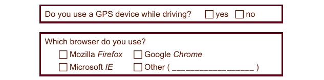

上面的问题包括一个开放式类别，“其他”。当然，整个问题可能是开放式的，如下所示：

封闭式问题简化了后续分析，因为统计回复的计数很简单。

了解参与者的性别和年龄通常很重要，因为这有助于识别人群。年龄可以作为开放式比率量表响应来征求，如下所示：

以这种方式收集，平均值和标准差很容易计算。比率量表响应在查找数据中的关系时也很有用。例如，如果同一份问卷还包括一个关于每天发送的短信数量的比率量表项目，那么就可以确定响应是否相关（例如，每天发送的短信数量是否与年龄有关？年龄也可以作为序数响应进行请求，如以下示例所示：

在这种情况下，将列出每个类别中的计数。如果有大量受访者，这些数据特别有用。但是，序数数据本质上质量低于比率标度数据，因为无法计算均值或标准差。

在实验结束时，还使用问卷来获取参与者对界面或交互技术的意见和感受。项目通常使用李克特量表（见图 4.7）进行格式化，以便于总结和分析响应。一个例子是NASA-TLX（任务负荷指数），它评估六个分量表的感知工作量：精神需求、身体需求、时间需求、绩效、努力和挫折（Hart和Staveland，1988）。关于挫折的调查问卷可以按以下方式提出：

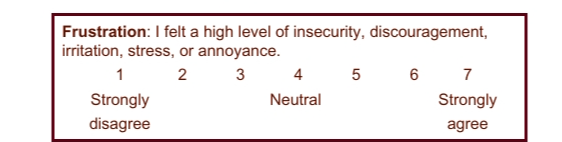

非键盘输入设备的 ISO 9241-9 标准包括一份包含 12 个项目的问卷，用于评估参与者所经历的舒适度和疲劳度 （ISO 2000）。这些项目类似于NASA-TLX中的项目，但通常用于与鼠标、操纵杆或眼动仪等设备进行交互。这些项目可以根据被测设备进行定制。例如，对用于计算机控制的眼动仪的评估可能包括具有以下响应选项的问卷（另见Zhang和MacKenzie，2007）

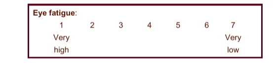

请注意，首选响应是 7，而 NASA-TLX 示例中的首选响应是 1。如果在多个响应项上计算均值，则始终如一地构造这些项非常重要

## 5.10 Within-subjects and between-subjects

测试条件（因子的水平）的管理要么在受试者内部，要么在受试者之间进行。如果每个参与者都在每个级别上接受测试，则分配是在受试者内进行的。受试者内也称为重复测量，因为每个参与者对每个测试条件的测量都是重复的。如果每个参与者只在一个级别上接受测试，则分配是在受试者之间进行的。对于受试者间设计，每个测试条件都使用一组单独的参与者。图 5.6 提供了主题内分配和主题间分配之间差异的简单说明。
 
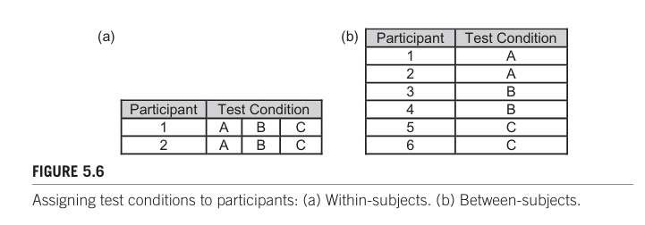

图5.6a显示了受试者内的分配，因为每个参与者都接受了该因素的所有三个级别的测试（但参见第5.11节，平衡）。图5.6b显示了受试者之间的分配，因为每个参与者只在因素的一个水平上进行测试。有三组参与者，每组两名参与者。

显然，这需要权衡取舍。对于受试者间设计，每个参与者只在一个因子的一个水平上进行测试;因此，需要更多的参与者才能获得相同数量的观察结果（图5.6b）。对于受试者内设计，每个参与者都要接受一个因素的所有水平的测试。需要更少的参与者;然而，每个参与者需要更多的测试（图5.6a）。鉴于这种权衡，我们有理由问：在受试者内部还是在受试者之间分配一个因素更好？让我们来看看各种可能性。

有时，一个因素必须是主体之间的因素。例如，如果研究正在调查男性还是女性更擅长发短信，那么实验可能涉及在手机上输入短信。自变量是性别，有两个层次，男性和女性。变量性别在受试者之间。显然，别无选择。参与者在一半的测试中不能是男性，然后在另一半测试中是女性！另一个例子是惯用手。调查左撇子和右撇子用户之间性能差异的研究需要一组左撇子参与者和一组右撇子参与者。因此，惯用手是受试者之间的因素。别无选择。

有时，一个因素必须是受试者内部的。最明显的例子是实践，因为技能的获得发生在人与人之间，而不是人与人之间。实践通常通过测试参与者在多个试验块中进行调查。

对于此类设计，块是一个自变量或因子，并且有多个级别，例如块 1、块 2、块 3 等。显然，阻滞是在受试者体内，因为每个参与者都暴露于多个测试块。别无选择。

有时有一个选择。上面提到了一个重要的权衡。也就是说，受试者内设计需要更少的参与者，但需要对每个参与者进行更多的测试。使用较少的参与者有一个显着的优势，因为如果参与者较少，则招募、日程安排、简报、演示、练习等会更容易。

受试者内设计的另一个优点是，由于参与者的倾向而导致的方差在测试条件下大致相同。在这里，易感性是指参与者的性格、精神状况或身体状况中可能影响表现的任何方面。換句話說，傾向於緺致（或邋遢！）的參與者很可能在測試條件中以相同的方式帶來他們的性格。对于受试者之间的设计，有更多的参与者，因此，由于参与者之间的固有差异，可变性更大。

受试者内设计的另一个优点是，没有必要平衡参与者群体——因为只有一组！受试者间设计包括针对每个测试条件的单独参与者组。在这种情况下，需要平衡以确保各组在可能在测量中引入偏差的特征方面或多或少相等。平衡通常通过随机分配来完成，但也可以通过根据合理的标准明确地将参与者分组来完成（例如，确保各组之间的计算机体验水平相似）。
 
由于刚才提到的三个优点，HCI中的实验往往更倾向于受试者内的设计，而不是受试者之间的设计。
  
但是，主题间设计有一个优势。受试者间设计避免了测试条件之间的干扰。这里的干扰是指当参与者暴露于一个测试条件，然后切换到另一个测试条件时出现的冲突。例如，考虑一个实验，该实验旨在测量使用两个键盘的触摸打字速度。学习使用一个键盘触摸打字时获得的运动技能可能会对使用另一个键盘的触摸打字产生不利影响。显然，参与者不能在测试另一种条件之前“忘记”一种条件。受试者之间的设计避免了这种情况，因为每个参与者都在一个键盘上进行测试，并且只有一个键盘。如果干扰可能很小，或者可以通过一些热身试验来减轻干扰，那么受试者间设计的好处就会减弱，受试者内设计是最佳选择。
  
事实上，HCI实验中出现的大多数因素都是这样的，因此因素的水平往往在受试者内部分配。我将在下一节中详细介绍干扰。

值得注意的是，在许多研究领域，很少使用受试者内设计。例如，测试新药的研究不会使用受试者内设计，因为可能会产生干扰效应。通常使用主题间设计。

对于具有两个因子的实验，可以分配受试者内部一个因子的水平和受试者之间另一个因子的水平。这是一个混合设计。考虑一个实验的例子，该实验试图比较左撇子和右撇子用户对文本输入方法的学习。该实验有两个因素：Block 在受试者中可能有 10 个级别（块 1、块 2......第 10 块）和惯用手是两个级别（左、右）的受试者之间的。

##  5.11 Order effects, counterbalancing, and latin squares

当一个因子的水平（测试条件）在受试者内分配时，参与者会接受一个条件的测试，然后是另一个条件，依此类推。在这种情况下，如上所述，由于测试顺序，可能会导致测试条件之间的干扰。在大多数受试者内设计中，参与者的表现可能会随着他们从一个测试条件进展到下一个测试条件而提高。因此，参与者可能在第二种条件下表现得更好，因为他们从第一种条件下的练习中受益。他们熟悉了设备和程序，并且正在学习更有效地完成任务。

练习是一个混淆变量，因为练习的数量从一个条件到下一个条件逐渐增加。这被称为练习效应或学习效应。虽然在人机交互实验中较少见，但也有可能在后续条件中表现出性能下降。这可能是由于精神或身体疲劳——疲劳效应。总的来说，这种现象是一种顺序效应或序列效应，可能表现为改善的性能或退化的性能，具体取决于任务的性质、测试条件的固有属性以及在被试设计中测试条件的顺序。

如果实验的目标是比较测试条件，以确定哪个更好（在依赖变量的性能方面），那么实践的混淆影响会严重损害比较的结果。补偿顺序效应的最常见方法是将参与者分成不同的组，并为每组以不同的顺序进行条件的实施。为了抵消实践效应，对测试条件进行补偿性排序的方法被称为交叉平衡。

在最简单的情况下，一个具有两个水平的因子，比如A和B，参与者被分成两组。如果总共有12名参与者，那么第1组有6名参与者，第2组也有6名参与者。第1组首先在条件A下进行测试，然后在条件B下进行测试。第2组则以相反的顺序进行测试。这是拉丁方阵的最简单情况。一般而言，拉丁方阵是一个n×n的表格，其中填充了n个不同的符号（例如A、B、C等），使得每个符号在每一行和每一列中都恰好出现一次。一些拉丁方阵表格的示例如图57所示。仔细观察，模式很容易看出来。

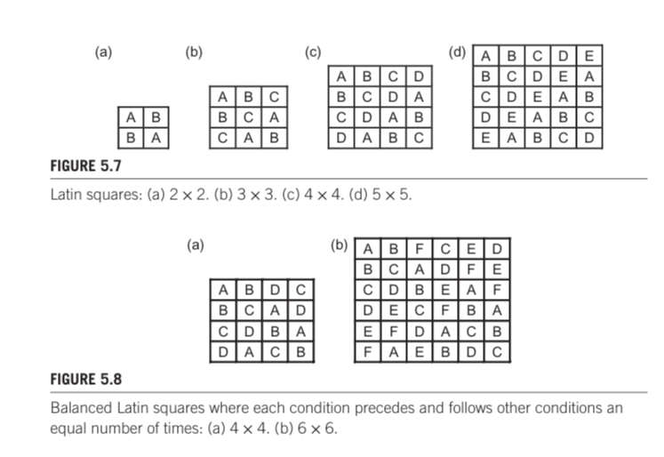

第一列按顺序排列，从A开始。行中的条目按顺序排列，循环。

在3阶及更高阶的拉丁方中存在一个问题，即某些条件在前后出现的次数不相等。例如，在4×4的拉丁方中，B跟随A三次，但A只跟随B一次。因此，如果存在A-B序列效应，它并没有完全被补偿。解决这个问题的方法是构建均衡的拉丁方，适用于偶数阶的表格。图58展示了4×4和6×6的均衡拉丁方。模式有点奇特。第一列按顺序排列，从A开始。顶行的序列为A、B、n、C、n−1、D、n−2等。第二列及后续列的条目也按顺序排列，循环往复。
 
当设计一个被试内平衡实验时，因素的水平数必须能够均匀地被参与者整除。如果一个因素有三个水平，那么实验需要3的倍数的参与者；例如，9、12或15名参与者。如果有12名参与者，那么将分为三组，每组4名参与者。条件按照ABC顺序分配给第1组，按照BCA顺序分配给第2组，按照CAB顺序分配给第3组（见图57b）。让我们通过一个假设性的例子来探讨这个设计。

一个实验者试图确定三种编辑方法（A、B、C）在完成常见编辑任务所需的时间上是否有差异。评估中使用了以下任务。

 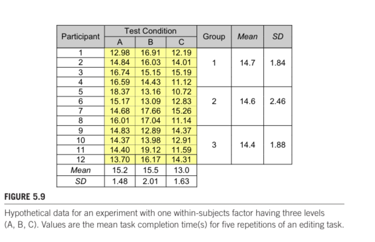

以下三种编辑方法进行了比较（描述仅为近似）：

+ 方法A：箭头键、退格键、输入

+ 方法B：搜索和替换对话框

+ 方法C：用鼠标点击并双击，然后输入

招募了 12 名参与者。为了平衡学习效果，参与者被分成三组，根据拉丁方块管理任务（见图5.7b）。每个参与者使用一种编辑方法执行任务五次，然后使用第二种编辑方法再次执行任务，然后使用第三种编辑方法再次执行任务。使用每种编辑方法的每个参与者的平均任务完成时间以表格形式列出。（请参阅图 5.9。还显示了每种编辑方法和每组的总体均值和标准差。请注意，图中测试条件的从左到右顺序仅适用于第 1 组。第 2 组的顺序是 BCA，第 3 组的顺序是 CAB（见图 5.7b）

在130秒时，鼠标方法（C）最快。箭头键方法（A）在152秒时慢了174％，而查找和替换方法（B）在155秒时慢了193％。（对差异的统计显著性进行测试将在下一章中讨论。）显然，平衡效果很好，因为组均值非常接近，仅相差03秒。图59中的表格数据通常不会在研究报告中提供。更有可能的是，结果会以类似图5.10的图表形式呈现。

尽管在上面的假设示例中平衡起作用，但 3 × 3 拉丁方块存在潜在问题。请注意，在图 5.7b 中，B 跟随 A 两次，但 A 只跟随 B 一次。所以存在不平衡。这在条件为奇数的拉丁方块中是无法避免的。在这种情况下，一种解决方案是使用所有序列进行平衡。3 × 3 的情况如图 5.11 所示。

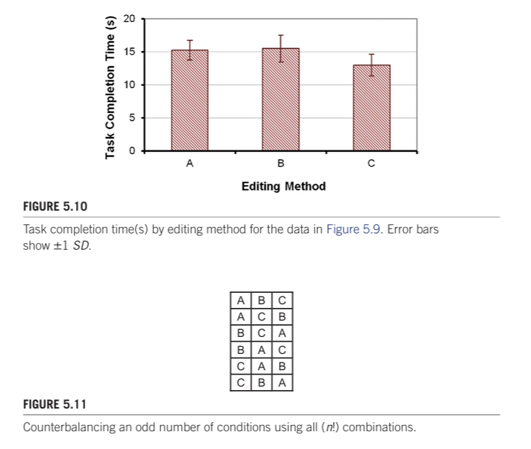

有6种组合。平衡已完成（例如，B跟随A三次，A跟随B三次）。MacKenzie和Isokoski（2008）在一个实验中使用了这样的安排，共有18名参与者，每个顺序分配3名参与者。

另一种抵消学习效应的方法是随机排列条件的顺序。这在以下情况下最合适：（a）任务非常简短，（b）任务有很多重复，（c）有很多测试条件。例如，使用点选任务的实验通常将移动方向、移动距离或目标大小作为因素（图512）。

图512中的测试条件可能会成为实验中的因素，即使实验的主要目标是其他方面。例如，比较不同指向设备性能的研究可能将设备作为一个因素，例如三个水平（鼠标、轨迹球、触控笔）。移动方向、移动距离和目标大小可能会有所变化。

## 5.12 Group effects and asymmetric skill transfer

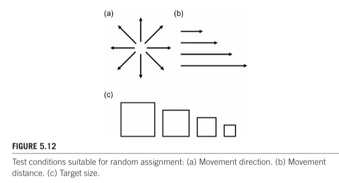

如果在受试者内设计中，不同条件的学习效果相同，则因变量上的组均值应近似相等.11 这在上面已经证明（见图 5.9）。换言之，在实验后期测试条件时，由于练习而产生的优势同样被在实验早期测试相同条件时的劣势所抵消。这就是平衡的重点。但是，在某些情况下，一个阶（例如，A→B）与另一个阶（例如，B→A）会出现不同的效果。在这种情况下，可能存在群体效应，即因变量的平均分数在各组之间存在差异。发生这种情况时，这是一个问题。从本质上讲，平衡是行不通的。群体效应通常是由于不对称的技能转移，即改进量的差异，具体取决于测试的顺序。
 
我们可以使用假设数据来开发一个非对称技能转移的示例，就像上面的平衡示例一样；然而，在一份研究报告中存在一个非对称转移效应的实例数据集。这个示例很好地展示了这种效应，并且有助于理解为什么会发生非对称技能转移。因此，我们将使用那份数据。该实验比较了两种用于文本输入的扫描键盘类型（Koester和Levine，1994a）。扫描键盘使用屏幕上的虚拟键盘和一个单一的按键或开关进行输入。按键行逐一高亮显示（扫描）。当高亮显示所需字母的行时，它被选中。扫描从左到右进入行。当高亮显示所需字母的按键时，它被选中，并将字母添加到文本消息中。扫描键盘为许多身体残疾用户提供了方便的文本输入方法。

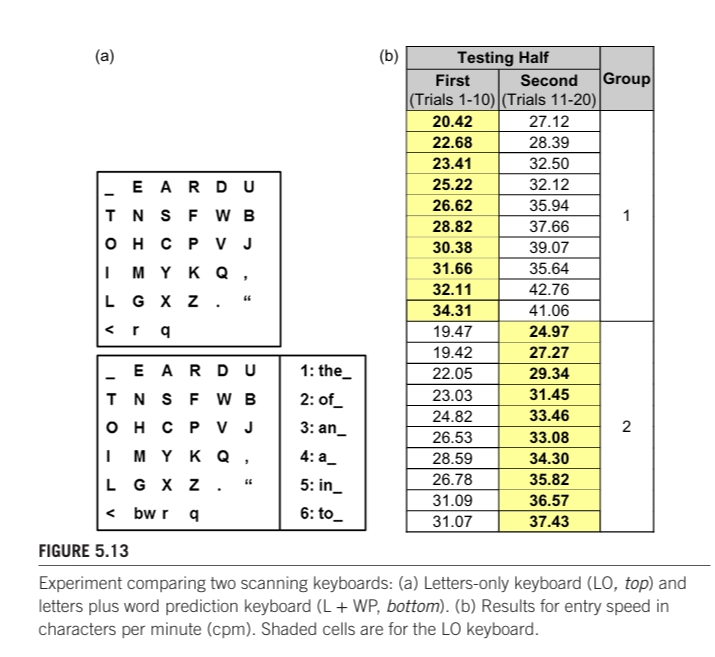

该实验比较了一个仅包含字母的扫描键盘（LO）与一个添加了单词预测功能的类似键盘（L + WP）。这些键盘在图513a中展示。六名参与者输入了20个短语的文本，其中10个使用一个键盘，然后使用另一个键盘输入另外10个。为了补偿学习效应，采用了交叉平衡法。参与者被分成两组。第一组先使用LO键盘输入文本，然后使用L + WP键盘；第二组则相反。尽管通常不在报告中提供，但结果以每分钟字符数（cpm）的形式呈现在表格中。数据在图513b中重现，与原始报告中的数据一致（Koester和Levine，1994a，表2）。两列显示了测试的顺序：第一半和第二半。阴影和非阴影单元格分别显示了LO和L + WP键盘的结果，从而揭示了交叉平衡的顺序。
 
在图513b中，至少有三种方法可以总结数据。总体结果显示LO键盘和L + WP键盘之间的差异，显示在图514的左侧图表中。显然，这两种键盘之间的差异很小：LO键盘的速度为300 cpm，而L + WP键盘的速度为303 cpm。L + WP键盘只快了1％。误差棒较大，主要是由于从试验到试验的改进，如图513b所示。

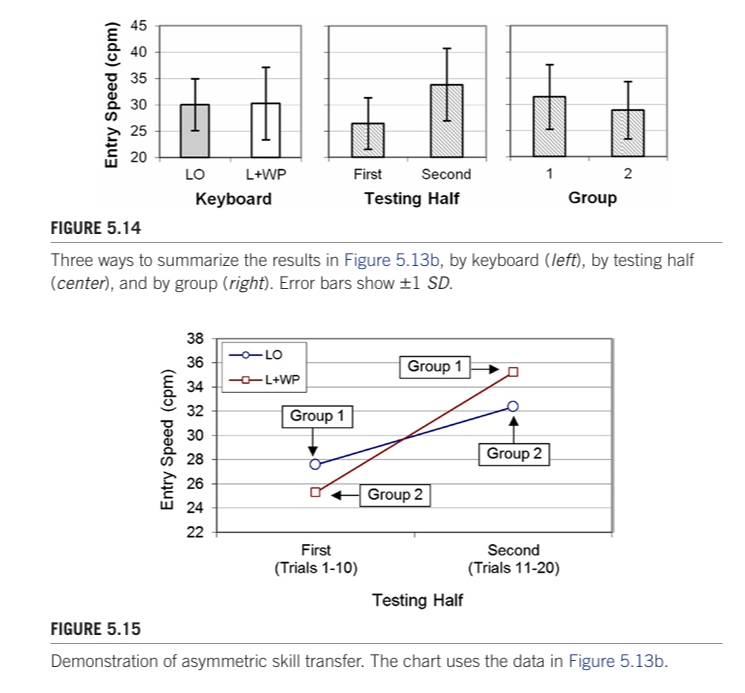

图514中心图展示了另一种结果视角，对比了测试的前半部分和后半部分。明显可以看到学习效应。整体输入速度在测试的前半部分（试验1至10）为264 cpm，在测试的后半部分（试验11至20）为338 cpm，比前半部分高出28%。这种学习效应是完全可以预期的，因此这个结果并不令人意外。

现在请考虑图514右侧的表格。只有在顺序效应相同或相似的情况下，交叉平衡才有效。这意味着LO→L + WP顺序的性能优势与L + WP→LO顺序的性能优势相同。如果是这样，组均值将大致相等（这在交叉平衡示例中已经证明过，见图59）。然而，图514右侧的表格揭示了一个不同的情况。第一组的平均值为314 cpm，而第二组的平均值较低，为288 cpm。由于某种原因，第二组存在8%的性能劣势。这是一种非对称的技能转移示例。图515进行了说明。该图将图513b中的数据简化为四个点，每个点代表10次试验的一个象限。在测试的前半部分和后半部分之间，连接LO点和L + WP点的线的交叉明显可见。

如果平衡计算起作用，图515中的线条应该大致平行。它们之所以不平行，是因为LO→L + WP顺序与L + WP→LO顺序之间的不对称性。通常，不对称的技能转移可以通过考虑测试条件或实验程序来解释。对于这个实验，效应是因为使用仅有字母（LO）键盘与使用字母加上单词预测（L + WP）键盘之间的固有差异。实际上，这个例子为了理解为什么有时会出现不对称的技能转移提供了一个很好的机会。以下是解释。L + WP键盘是LO键盘的增强版本。输入字母的基本方法在两种键盘上都相同；然而，L + WP键盘添加了单词预测功能，允许在输入单词的所有字母之前输入单词。

很有可能，首先使用LO键盘输入文本是对后续更难的L + WP键盘输入任务的良好练习。要理解这一点，请查看图515中标记为第1组的两个点。第1组参与者整体表现更好，因为他们最初在更容易的LO键盘上进行了测试，然后再转向增强的L + WP键盘。第2组参与者表现较差，因为他们最初在更困难的L + WP键盘上进行了测试。

避免不对称技能转移的最简单方法是使用受试者间设计。显然，如果参与者只接触一个测试条件，他们就无法从另一个测试条件中获得技能转移。还有其他可能性，比如让参与者在数据收集之前练习某个条件。练习试验旨在克服之前条件中练习的好处，以便测量的表现准确反映测试条件的固有属性。不清楚这在实际中是否有效。参与者无法“忘记”。
 
最后，LO和L + WP键盘之间的性能差异仍然是一个值得研究的问题。实践效应（28%）远远大于群体效应（8%），因此很难说L + WP键盘中的单词预测是否提供了性能优势。显然，L + WP键盘有益处，因为可以在输入所有字母之前输入单词。然而，这也有一个代价，因为用户必须关注正在进行的预测过程，这会减慢输入速度。为了确定长期来看成本是否超过了收益，需要进行一项纵向研究。这将在下一节中进行探讨。

 ##  5.13 Longitudinal studies

前面的讨论集中在实验中学习对被试内分配的自变量产生的混杂影响上。学习效应——更一般地说，顺序效应——是有问题的，必须以某种方式加以考虑，比如平衡对照。然而，有时研究对学习或技能的习得特别感兴趣。在这种情况下，实验程序涉及在较长时间内测试用户，同时测量其绩效的改善。研究不是要消除学习，而是要观察和测量它。参与者在较长时间内练习的实验评估被称为纵向研究。

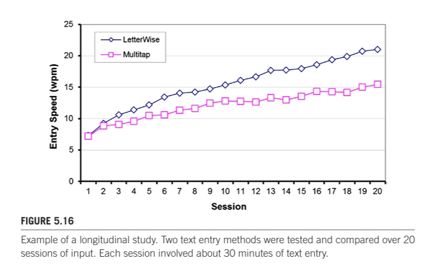

在一项纵向研究中，“练习量”是一个自变量。参与者在多个测试单位上执行任务，观察和测量他们随着练习的改善情况。每个测试单位都是自变量的一个水平。对于自变量，有各种不同的名称，但典型的例子是会话，其水平为会话1、会话2、会话3等。例如，有一个实验比较了手机的两种文本输入方法：多点触控和LetterWise（MacKenzie、Kober、Smith、Jones和Skepner，2001）。对于英文文本输入，LetterWise所需的按键次数平均比多点触控少44％。

然而，性能优势可能不会立即显现，因为用户必须学会这项技术。此外，学习发生在两种方法中，参与者熟悉实验程序和任务。然而，人们认为LetterWise的减少按键次数最终会产生更高的文本输入速度。为了测试这一点，进行了一项纵向研究，将输入方法分配给不同的受试者。结果显示在图516中。确实观察到了随着实践的改善。初始输入速度在第1次会话中对于两种方法都约为73 wpm。随着实践，两种方法都有所改善；然而，由于LetterWise能够平均减少英文文本的按键次数，因此LetterWise的改善更大。到第20次会话时，LetterWise的文本输入速度为210 wpm，比多次点击的速度155 wpm高出约36％。

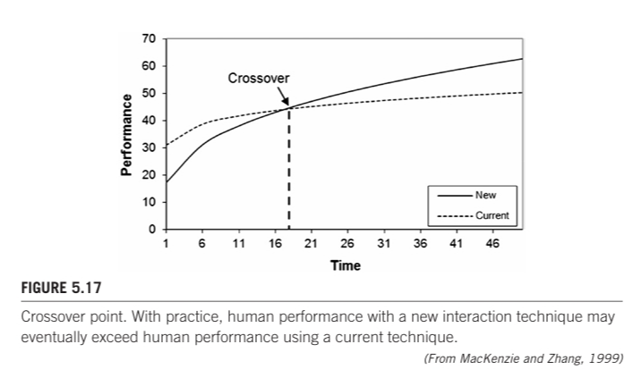

纵向研究中的绩效趋势，如图515所示，通常伴随着一个方程和最佳拟合曲线，展示了学习的幂律。示例见第7章，第725节（技能获取）。

在许多情况下，纵向研究的目标是比较一种新技术与当前实践的可行性。在这里，当前实践是指可以用性能指标量化的任何传统互动方式，例如文本输入、编辑、指向、选择、搜索、平移、缩放、旋转、绘图、滚动、菜单访问等。如果用户对当前互动技术有经验，那么新技术的初始性能可能较差。但随着学习的进展，性能趋势可能最终会交叉，新技术的性能超过当前实践。这在图517中有所说明。

作为一个例子，考虑到无处不在的Qwerty键盘。尽管有改进的设计被提出，但是熟悉Qwerty键盘的用户在使用其他设计的键盘时不太可能立即表现出性能的改善。在新键盘上表现超过Qwerty键盘可能需要相当的练习。例如，Dvorak简化键盘（DSK）在纵向研究中被证明比Qwerty键盘更快（请参阅Noyes，1983年的综述）。

然而，Qwerty仍然是计算机键盘的主要形式。从实际角度来看，学习一种新技术是有成本的，因为初始性能与当前技术相比更优。然而，在达到交叉点之后，新技术会带来好处，因为性能优于当前实践。成本效益权衡如图518所示。

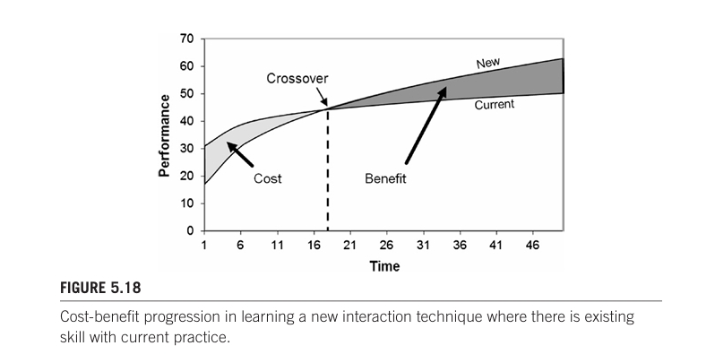

尽管图518中显示的长期效益明显，新技术往往在边缘徘徊，而已建立但不太优化的设计仍然主导市场。显然，这些好处往往不足以抵消成本。

关于Qwerty键盘的争论，存在两个成本。一是制造和改装成本。键盘是电机械设备，因此新设计需要从头重新设计和使用新的制造材料和程序。这是昂贵的。另一个成本在于克服用户的看法和态度。总的来说，用户对变化持保守态度：他们不愿放弃已经习惯并且感到舒适的习惯。简而言之，用户“不愿意因为需要重新培训而改变到新的键盘布局”（Noyes，1983，第278页）。
 
一个有趣的例子是软键盘或虚拟键盘，通常在触摸屏手机或个人数字助理（PDA）上使用。输入通常是用手指或触控笔完成的。大多数这类键盘使用Qwerty字母排列。然而，由于键盘是在软件中创建的，因此与另一种设计相关的重新加工成本是不存在的。因此，优化设计进入市场的机会可能更大。一个增加文本输入速度的想法是将常用字母聚集在布局中心附近，将不常用字母推到边缘。速度的提高是由于手指或笔尖的移动减少。然而，由于用户对优化的字母排列不熟悉，初始表现较差（直到他们适应了字母排列）。如果学习新技术可能需要几个小时或更长时间，那么评估需要进行纵向研究，用户在多个输入会话中进行测试。最终，交叉点可能会出现。这个想法在第7章第725节（技能习得）中进一步探讨。

 ##  5.14 Running the experiment

当实验设计完成、仪器建造并测试完毕、被试招募并安排好后，测试才开始。但是等等！您确定开始的时间已经到了吗？进行一次（是的，再来一次）试点测试总是很有用的，可以选择一到两名被试。这将有助于优化被试的简报和准备流程。它还可以检查每位被试所需的时间是否合适。如果测试计划为一小时，那么确保包括简报、练习等在内的所有测试都能在一小时内顺利完成是很重要的。最后，可能需要微调一下实验方案。现在进行比以后后悔要好。

实验开始了。实验员向每位参与者问候，介绍实验，并通常要求参与者签署同意书。通常会进行一份简短的问卷，以收集人口统计数据和有关参与者相关经验的信息。这应该只需要几分钟。仪器被揭示出来，任务被解释并演示。根据需要，可以进行练习试验。

实验的一个重要方面是给参与者的指导。当然，这些指导取决于实验的性质和任务。对于大多数互动任务，参与者被期望迅速且准确地进行。然而，这里的“迅速”和“准确”都需要根据参与者的能力来解释。对于一个参与者来说，合理的迅速可能对另一个人来说是不可达到的。通常目标是以个体舒适的速度，准确地完成任务。无论如何，指导必须经过慎重考虑，并以相同的方式传达给所有参与者。如果有参与者要求澄清，我们必须小心地详细解释指导。要避免任何可能导致参与者与其他人行动不同的额外解释。
  
实验者在实验中扮演着特殊的角色，作为实验的公众形象。重要的是，实验者应该保持中立，不让参与者感到压力，以产生特定的结果。刻意地在不同测试条件下表现更好是要避免的。此外，参与者不应该感受到实验者的特定态度。过于关注的实验者可能会让参与者感到紧张。同样，实验者应该避免传达冷漠或漠视。如果实验者表现出不在乎的态度，参与者可能会对自己的表现不太在意。中立的态度是更好的选择。

