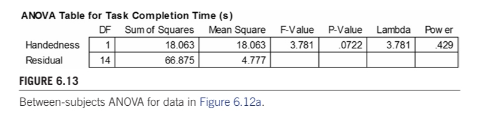

# Hypothesis Testing

在鸡尾酒会上，最好避免讨论宗教或政治。原因当然是人们对这些棘手话题的意见往往既强烈又分歧。让我们再加上统计学。几乎没有什么话题能比在实验研究中将统计技术应用于数据和假设更能引起争议了。幸运的是，读者并没有被卷入这场争论。相反，本章将描述并介绍人机交互研究中通常使用的一些有用的统计工具和技术。在接下来的篇幅中，我将努力将理论和争论最小化，同时将实用价值最大化。

假设检验的统计程序有两种：参数检验和非参数检验。本章将对这两种方法进行研究。它们的显著特点是：参数检验对来自概率分布（如正态分布或 t 分布）的数据进行检验，而非参数检验是 "无分布 "的，也就是说，它们对基础数据的分布不做任何假设。区分参数检验与非参数检验的有效方法是根据被检验数据的测量水平或尺度（Sheskin，2011 年，第 109 页；Siegel，1957 年，表 1）。图 6.1 举例说明。图中显示了第 4 章（见第 4.4.2 节）中讨论的四种测量尺度，其中比率数据最复杂，名义数据最不复杂。

参数检验适用于比率数据和区间数据，但最常用于比率数据。本章将详细讨论的方差分析（ANOVA）是最广泛使用的参数检验方法。 

在人机交互的实验研究中，比值数据通常是人类性能的测量值，如完成任务的时间、速度或准确性，或事件计数，如按键、手指弹动、视线移动或目标重入。非参数检验适用于任何规模的数据，尽管它们最常用于名义或序数数据。本章研究的非参数检验方法包括用于名义数据的卡方（χ2）检验和用于序数数据的曼惠尼 U 检验、威尔科克森符号秩检验、克鲁斯卡尔-瓦利斯检验和弗里德曼检验。通常，非参数检验使用的数据是名义类别、问卷回答、评级分数或量表评估。对于比率数据，非参数检验的使用很有限，我们将在本章稍后讨论。

由于非参数检验被认为与所有四个测量量表相关（见图 6.1 右栏），因此它们比参数检验更普遍适用。然而，根据功率标准，参数检验优于非参数检验。这是参数检验的强假设和强要求的副产品。只要假设得到合理的遵守，参数检验就有更大的能力（功率）在所进行的统计检验中得出正确的结论。

本章的大部分内容都是针对方差分析的。然而，大多数使用方差分析的研究人员对方差分析中 "F 检验 "的计算和假设了解甚少。这也没有关系。不过，了解检验的含义、如何进行检验以及如何解释和说明检验结果是非常重要的。因此，我们在这里采用的方法更像是教科书，而不是学术性的

##  6.1 Analysis of variance

方差分析或 F 检验是因子实验中进行假设检验的主要统计程序。大多数描述实验的人机交互研究论文都包含方差分析结果，给出 F 统计量、F 统计量的自由度以及相关的 P 值（稍后解释）。方差分析结果通常在括号中报告，以支持说明 检验结果是否具有统计学意义。

方差分析确定自变量（测试条件）是否对因变量（测得的反应）有显著影响。方差分析通过将因变量观测值的方差划分为可归因于方差的各个部分来确定。可归因的成分 "是测试条件（因子和水平）和参与者。如果一个因子在不同水平上的方差相对于所有其余方差（其他因子和参与者）较大，那么通常可以得出结论：该因子的显著特性--测试条件中的特征--导致了因变量测量结果的观测差异。如果是这样，就可以说该因素对因变量产生了具有统计学意义的影响。

根据实验设计的不同，方差分析有不同的设置方法。本讨论从具有两个测试条件的简单单因素设计开始。然后，我将讨论具有四个测试条件的单因素设计。如果有两个以上的测试条件，通常会使用事后比较检验，我也会举例说明。然后，我将讨论包含两个或更多因素的更复杂的设计，每个因素都有两个或更多水平。

最初的示例假定在受试者中分配测试条件。这意味着每个参与者都要接受某一因素所有水平的测试。有些设计的测试条件是在受试者之间分配的，即招募一组单独的参与者，并将其分配给每种测试条件。下面还给出了几个主体间方差分析的例子

### 6.1.1 Why analyze the variance?

我在前面提到，研究问题通常是比较性的。通常，研究的目的是比较两种或两种以上的界面或交互技术，以确定哪种更好。我所说的 "更好 "是指在一个或多个因变量上的优异表现，如任务完成时间、错误率、任务重试次数、退格键的按下次数、目标重试次数等。有趣的是，这项测试被称为方差分析，但我们更关心的是总体表现：

上面的问题指的是时间--观察和测量的总体、平均时间。平均值是针对多个用户的每个测试条件计算出来的，通常是针对一项代表性任务的多次试验计算出来的。在某些情况下，对一项任务进行多次试验是为了调查学习效果（见第 4 章，纵向研究），但使用多次试验的目的往往只是为了获得稳定和有代表性的测量结果。不过，我们感兴趣的是平均值的差异，而不是方差。请注意，上述研究问题固然重要，但所追求的统计问题根本不是问题。它是一个被称为 "零假设 "的陈述：

假设 "无差异"，这是一个合理的起点。方差分析对数据进行检验，以确定零假设为真（成立）或为假（被拒绝）的可能性。在大多数情况下，研究人员会设法拒绝零假设。按照惯例，统计上显著的结果意味着零假设为真的可能性很小。这种情况下的结论是：(a) 均值存在差异；(b) 差异在统计上显著；(c) 差异是由试验条件中的可区分特性造成的。让我们来看看如何做到这一点。

假设有这样一个实验：10 名参与者使用两种交互技术重复完成一项任务。交互技术可以是任何技术，例如使用鼠标和键盘。实验选择的任务既能代表常见的交互方式，又有可能暴露出内在的差异。鼠标与键盘交互的例子可能是在分层菜单中选择选项。在本讨论中，我将保持简单明了，将这两种技术分别称为方法 A 和方法 B。请记住，本实验只有一个因素（交互方法）和两个水平（方法 A 和方法 B）。

成绩是根据任务完成时间（以秒为单位）等因变量来衡量的，并计算出每个参与者在几次试验中的平均值。然后计算每种方法的平均值。图 6.2 中的条形图显示了这一假设实验的两个结果示例。

在图 6.2a 和图 6.2b 中，任务完成的平均时间相同；但是，标注的结果却大相径庭。在图 6.2a 中，平均值的差异在统计学上是显著的。这意味着观察到的差异很可能是真实的，是由于方法 A 和方法 B 的不同特性造成的。

在图 6.2b 中，平均值的差异在统计上并不显著。这意味着平均值的差异很可能是偶然造成的。没有合理的依据表明任何一种方法都比另一种方法快。再做一次测试，结果很可能相反。尽管解释大相径庭，但这两个例子似乎是一样的：方法 A 的任务完成时间为 4.5 秒，而方法 B 为 5.5 秒。答案就在于观察结果的差异性--方差。让我们仔细看看。

图 6.3a 给出了图 6.2a 中的模拟数据，即每位参与者使用每种方法完成任务的平均时间（以秒为单位），以及每种方法的总体平均值和标准偏差。图 6.3b 显示了相应的柱形图，并带有误差条。误差条显示平均值的 ±1 个标准差。在数学上，方差是标准偏差的平方；然而，在研究论文中，报告标准偏差更为常见，因为标准偏差和平均值的单位相同（本例中为 "秒"）。

对图 6.3a 中的数据进行方差分析的步骤取决于所使用的统计程序。尽管如此，结果还是与图 6.4 中的表格相似。
   
表中最重要的统计量是 "P 值"。这是在零假设成立的情况下获得观测数据的概率。概率低，说明根据零假设，不可能出现均值差异。高概率表明均值差异可能只是偶然因素造成的。当 p = 0.0121 时，有一个相当低的概率--小于 2%--即差异仅仅是一个偶然的结果。很有可能是一种或另一种方法的某些固有的显著特性造成了差异。请注意前一句中的 "造成 "一词。实验研究之所以如此有价值，原因之一就是可以得出因果关系的结论。

根据实验研究的惯例，统计学意义上的显著性要求 p 小于 0.05，即 20 分之 1 的概率。换句话说，我们认为零假设是成立的，除非有 20 分之 1 或更小的概率认为零假设是不成立的。除了概率，方差分析中的重要统计量还有 F 统计量（F 值，样本方差的比率）以及主效应（方法）和残差效应（方法 * 主体）的自由度。相关统计数据汇集成一份声明，宣布研究问题的结果。

图 6.5（F 四舍五入到三位有效数字）是假设实验的研究论文中可能出现的示例。请注意，图中没有精确引用概率。相反，p 被引用为小于集合 {.05，.01，.005，.001，.0005，.0001}中一个更保守的临界值。因此，p 被引用为 p < .05 而不是 p = .0121.6。

图 6.5 中的语言包括测试条件的均值和均值差异的说明。平均值的差异就是效应大小。在人机交互研究中，效果大小通常是通过给出均值和绝对差值（本例中为一秒）或相对差值来表达的。当然，效果大小是否具有实际意义并不在方差分析的范围之内。在研究论文中，F 统计量的格式往往很不规范，因此值得稍作停顿，观察一下图 6.5 中的 F 统计量：

+ 放在括号内

+ F 大写

+ p 为小写

+ F 和 p 为斜体

+ 等号两边的空格

+ 逗号后的空格

+ 小于号两侧空格

+ 自由度为下标、普通、较小的字体8

+ F 统计量为三或四位有效数字

+ P 统计量小数点前没有零（因为它被限制在 0 和 1 之间）

为完整起见，让我们来研究第二个例子，即图 6.2b 中的模拟。图 6.6 显示了数据和相应的带有误差条的柱形图。

如前所述，第二次模拟的结果在统计意义上并不显著。图 6.6b 中的大误差条就说明了这一点。方差分析以较高的 P 统计量值显示并证实了结果的不显著性。从图 6.7 中的 P 值可以看出，均值差异有 45% 的可能只是偶然结果。尽管平均值与第一次模拟相同，但参与者的表现差异很大，因此测试条件之间的平均值差异可能只是偶然造成的。例如，观察图 6.6a，8 号学员使用方法 A 在 1.2 秒内完成了任务，而 10 号学员则用了 6.6 秒。很明显，有一些情况超出了两种交互方法的解释能力。

在研究论文中，不显著的结果也需要报告。图 6.8 是第二个模拟的示例。请记住，非显著方差分析并不意味着零假设成立（即均值无差异）。不显著的方差分析只是表明证据不足以拒绝零假设： 零假设仍然成立。

对于不显著的结果，方差分析结果有两种报告方式。如果 F 小于 1，则效应不可能显著，此时用 "ns "代替 p，表示 "不显著"。

### 6.1.2 More than two test conditions

The example above involves one factor with two levels (test conditions). In practice, a factor often has more than two levels. Although the idea is similar, an example is worthwhile. Figure 6.9 gives the data and bar chart for a hypothetical experiment where four user interfaces or interaction methods are compared. The data are the observed, measured responses on a dependent variable.

An ANOVA on the data produces the table in Figure 6.10. Right off, we see that p is less than .05, the accepted threshold for significance. Plainly put, there was a significant effect of Test Condition on the dependent variable (F3,45 = 4.95,  p < .005). In the parentheses, the relevant statistics are pulled from the table, as before. The degrees of freedom are different in this example. If n is the number of test conditions and m is the number of participants, then the degrees of freedom are (n − 1) for the variance due to Test Condition and (n − 1)(m − 1) for the variance due to Test Condition × Subject.

Since the P-value in the ANOVA table is .0047, there is less than a 0.5 percent chance the difference in the means is a chance outcome. In all likelihood, the difference was caused by inherent properties of one or more of the test conditions. In other words, the effect of the test conditions on the dependent variable was  statistically significant.

###  6.1.3 Post hoc comparisons

The ANOVA in Figure 6.10 reveals only that at least one of the means is significantly different from at least one other mean. A quick glance at the bar chart in Figure 6.9b leaves us wondering which test conditions differ from which other test conditions. To determine this, a post hoc comparisons test is used. An example is the Scheffé test shown in Figure 6.11. Among the four test conditions, six comparisons are possible. Of these, only the A-C and B-C comparisons are significant. In others words, the means are significantly different between test conditions A and C and between test conditions B and C. The other four comparisons did not meet the 5 percent threshold for significance.

Several HCI research papers using a Scheffé post hoc analysis include the following: Chen and Chien, 2005; Czerwinski et al., 1999; Fang, Chai, and Ferreira, 2009; Freeman, Norris, and Hyland, 2006; Kurihara, Vronay, and Igarashi, 2005; Kuzuoka, Kosaka, et al., 2004.

### 6.1.4 Between-subjects designs

The examples above assume a within-subjects design: each participant was tested on all test conditions (levels of the factor). While within-subjects designs are the most common in HCI, between-subjects designs are also used. When performing an ANOVA on the data for either design, it is important to set up the analysis properly, as the variances are partitioned differently for within-subjects data versus between-subjects data.

Let’s consider an example experiment on the differences between left-handed and right-handed users in using a stylus to add calendar entries on a PDA. Depending on the screen layout, occlusion may occur when, for example, a lefthanded user interacts with widgets on the right side of the display. Does the occlusion affect performance? Maybe. Maybe not. For the experiment, 16 participants were recruited. Handedness was a between-subjects factor with two levels: left handers, with 8 participants, and right handers, with 8 different participants. Each participant performed a few iterations of an “add calendar entry” task. The mean times to complete the task for each participant are tabulated in Figure 6.12a. While such tables are generally not provided in research papers, the data are given here to illustrate the organization for between-subjects ANOVAs. Most ANOVA applications operate on a matrix of data where the number of rows equals the number of participants, so the data in Figure 6.12a are organized in sixteen rows.  The between-subjects factor is identified as an added column of nominal data. encoding the levels of the factor. “L” and “R” identify the participants who wereleft handers versus right handers.

Figure 6.12b summarizes the results by handedness, while Figure 6.12c presents the same information in a bar chart, as might appear in a research paper.  The ANOVA is performed on the 16 × 2 matrix in the right two columns in Figure 6.12a. The result is shown in Figure 6.13. The degrees of freedom are (n − 1) for the variance due to Handedness and (m − n) for the variance due to the Residual.

Since the P-value in Figure 6.13 is greater than .05, the difference between left handers and right handers was not statistically significant. Even though there was about a 10 percent difference between the groups—22.0 s for left handers, 19.9 s for right handers—there was considerable variability in the observations. Based on the results of this experiment, we consider the null hypothesis tenable and conclude that there is no performance difference between left and right handed users in performing the add calendar entry task on the system under test

### 6.1.5 Two-way analysis of variance

An experiment with two independent variables, or two factors, is called a “two-way design.” For such experiments, the analysis of variance tests for the main effects of each factor on the dependent variable, as well as an interaction effect. A significant interaction effect means that the factors in combination influence, or have an effect on, the dependent variable. Let’s see how these effects are revealed in a two-way analysis of variance.

If an experiment has two factors, there are three possibilities for assigning conditions to participants. The assignments may be within-subjects for both factors, between-subjects for both factors, or within-subjects for one factor and betweensubjects for the other. Figure 6.14 gives the results for a hypothetical experiment with both factors assigned within-subjects. The factors are device, with three levels, and task, with two levels. The devices could be, for example, a mouse, a trackball, and a stylus, while the tasks could be, for example, point-select and dragselect.13 But this isn’t important here. For the example, each participant was tested on all three devices and with both tasks in a simple target acquisition task. In this case, the experiment is referred to as a “3 × 2 within-subjects design.” We assume as well that the order of administering conditions was counterbalanced in some manner (see Chapter 5, section 5.11). The data show the measured responses on the dependent variable, task completion time, in seconds.

In Figure 6.14a, the data are given by participant, device, and task. Evidently, participant #12 performed task 2 with device 3 in nine seconds. The means and standard deviations are shown in the bottom rows, calculated across the 12 participants for each device-task condition. Figure 6.14b reorganizes the data to more clearly demonstrate the device and task effects. As seen, device 3 was the fastest, device 1 the slowest. Task 2 was performed slightly faster than task 1. Figure 6.14c shows the mean scores for each device and task in a bar chart, as might appear in a research paper. The error bars show ±1 standard deviation about the means.

 While there were differences between the three devices and two tasks, there were also variations in the responses, as evident along the bottom row in Figure 6.14a. So the question remains: were the observed differences significant and attributable to inherent properties of the devices or tasks, or were the differences simply a chance outcome? This question is answered by an analysis of variance. The ANOVA is performed on the core 12 × 6 matrix in Figure 6.14a. In preparing the data for analysis, it is important to properly assign the factors and levels. As organized in Figure 6.14a, the columns are ordered by device, with task nested within device. The results are shown in Figure 6.15.

 There are three results in Figure 6.15: the device main effect, the task main effect, and the device by task interaction effect. Let’s see how these results are pulled from the analysis of variance table and presented in a research paper. An example is given in Figure 6.16.

 It is a challenge to create interest in presenting statistical results. A reader who confronts a tedious, sterile recitation of statistic after statistic will quickly lose interest. The goal in reporting results is to selectively pull interesting and revealing measures and statistics from the large array of data that emerges in experimental research. Note in Figure 6.16 expressions like “difference was modest,” “slightly faster,” and “due solely to.” These are minor embellishments intended to improve the readability of the results. Further discussion is needed to explain the results (e.g., “The improved performance with device 3 with task 2 is attributed to….”).

 It is, of course, the data that are important, not the statistics. Statistical tests help assess hypotheses, but they are not the results per se. Day and Gastel (2006, 63) further emphasize this point: “Generally, a lengthy description of statistical methods indicates that the writer has recently acquired this information and believes that the readers need similar enlightenment.” Don’t feel compelled to explain the analysis of variance, or any other statistical method. Give the results in terms of the data, with supporting statistical tests conveyed plainly and without elaboration

### 6.1.6 ANOVA tool

A resource available on this book’s website is a Java utility called Anova2. Anova2 is a command-line application that processes data in a text file and produces an ANOVA table on the console. The utility supports five designs:

+ One-way with one within-subjects factor

+ One-way with one between-subjects factor

+ Two-way with two within-subjects factors

+ Two-way with one within-subjects factor and one between-subjects factor

+ Three-way with two within-subjects factors and one between-subjects factor

To illustrate the general operation of Anova2, Figure 6.17 shows the usage message if the program is run without arguments.

Although the API gives extensive instructions and examples, one example is included here. The file dix-example-10×2.txt contains the data shown in Figure 6.18. The data are from a hypothetical experiment on icon recognition, as described by Dix et al. (2004, 337). The single factor (F1) is icon design with two levels: natural and abstract. The data are the measurements for task completion time, the dependent variable. The first column contains the task completion times for the natural icons, the second column for the abstract icons. Each row contains the measurements for one participant. The hypothetical experiment used 10 participants

The mean task completion times (not shown) are 697.7 s for the natural icons and 750.3 s for the abstract icons. Evidently the recognition time for the natural icons was 7.0 percent less than for the abstract icons. An analysis of variance determines if the difference was statistically significant or if it was likely due to chance. The analysis is initiated from the command-line and outputs an ANOVA table to the console. (See Figure 6.19.) 

As seen in the table, and as might appear in a research paper, “The experiment revealed a significant effect of icon type on task completion time (F1,9 = 33.36, p < .0005).

### 6.1.7 Counterbalancing and testing for a group effect

As noted in the previous chapter, if a factor is assigned within-subjects, learning effects must be offset between conditions. The most common way to do this is counterbalancing. For a single factor with two levels (A and B), this requires dividing the participants into two equal groups. One group (G1) is tested on A followed by B, while the other (G2) is tested on B followed by A. The goal is to balance out, or cancel, any learning effect that takes place. If counterbalancing worked, there should be no group effect—no significant difference between G1 and G2. Simple enough, but how does one know counterbalancing worked? A group effect  is investigated by treating group as a between-subjects factor. Of course, group is not a factor in the sense of a research topic. Nevertheless, the data can be organized with group as a between-subjects factor and the ANOVA can test for a group effect—a main effect of group on a dependent variable.

I’ll illustrate this by modifying the icon design example in the previous section. Since the design was within-subjects, we’ll assume counterbalancing was used to offset learning effects. With 10 participants, there are two groups with 5 participants per group. One group was tested with the natural icons followed by the abstract icons (NA). The other group had the conditions in the reverse order (AN). The modified data are shown in Figure 6.20. The between-subjects group identifier appears as a separate column of nominal data. Headers lines are also added. This is an optional feature of Anova2 to improve the readability of the ANOVA table.

For the purpose of the ANOVA, the experiment is now a 2 × 2 design with one within-subjects factor (icon type with levels natural and abstract) and one between-subjects factor (group with levels NA and AN). Using Anova2, the ANOVA is performed on the data in Figure 6.20 using the same command, except specifying the new file, noting the presence of a between-subjects factor with two levels, and including the −h option indicating the presence of header lines. (See Figure 6.21.) The group effect, seen along the top row, is not significant (F1,8 = 0.466, ns). This is good news. A non-significant group effect means counterbalancing worked. Any learning that may have taken place was balanced out. The primary result of the experiment remains the same, although the F and p values are slightly different because of the new partitioning of data in computing the variances. The result is still a significant effect of icon type on task completion time (F1,8 = 30.68, p < .0005).

There is a third effect in Figure 6.21. This is the two-way interaction effect between icon type and group. As seen in the ANOVA table, the effect was not significant  (F1,8 = 0.277, ns). If this effect is significant, it represents a phenomenon known as asymmetric skill transfer (Poulton, 1974), meaning there was a learning effect and that it was different transitioning from A to N than from N to A (see Chapter 5, section 5.12).

In many research experiments, counterbalancing is used for within-subjects factors without actually testing for a group effect. This is largely a matter of choice. Consult the student exercises at the end of this chapter for some practice examples on the analysis of variance.

##  6.2 Chi-square test

A common statistical procedure for investigating relationships is the chi-square test, also known as the Pearson chi-square test, and sometimes using “squared” instead of “square.” The pronunciation is kī (to rhyme with sky). The relationships are between categorical, or nominal-scale, variables representing attributes of people, interaction methods, systems, and so on. The data are commonly summarized in a contingency table—a cross tabulation organizing data in rows and columns with each cell containing counts or frequency data for the number of observations in the category. A chisquare test compares the observed values—the counts in the table—against expected values. The expected values are developed under the assumption that there is no difference among the categories in the table. The chi-square test is a non-parametric test since the categories are nominal-scale attributes and do not have a probability distribution associated with them. A hypothetical example will illustrate.

Consider a research project investigating whether males or females differ in their methods of scrolling when using a desktop computer system. To study this, a large number of users are observed. For each user it is noted whether they are male or female and whether they scroll using the mouse wheel (MW), the scrollbar by clicking and dragging (CD), or the keyboard (KB). The categories are Gender (male, female) and Scrolling Method (MW, CD, KB). Figure 6.22a provides the data in a 2 × 3 contingency table. One hundred and one users were observed, including 56 males and  45 females. Counts for usage of the scrolling methods were 49 (MW), 24 (CD), and  28 (KB). Figure 6.22b shows the data in a bar chart, as might appear in a research paper.

A quick glance at the data and chart suggests that there may indeed be a difference between males and females in their methods of scrolling on desktop computer systems. Only 9 females used clicking and dragging, compared to 15 males. However, more males were observed overall, so the difference is not as dramatic as it seems. The issue, then, is whether the differences observed are real or simply due to random effects. To determine this, the chi-square test is used. The test statistic is written χ2, using the lowercase Greek letter chi. As with the analysis of variance, the underlying assumption is “no difference” with the test, seeking to reject the assumption. Unlike the analysis of variance, however, a chi-square test is simple. The calculations are easily done using a spreadsheet application. Let’s work through the details for this example.

The chi-square test is a comparison between the observed values and the expected values, with the expected values accounting for the different row and column totals. Figure 6.23a shows the expected values for the data in Figure 6.22a, under the no-difference assumption. Each expected value is the row total multiplied by the column total, divided by the grand total. For example, the Male-MW expected value is (56 × 49) / 101 = 27.2. From the observed and expected values, a table of chi-squares is created, as shown in Figure 6.23b. Each chi-square is the square of (the observed value minus the expected value), divided by the expected value. For example, the Male-MW chi-square is (28.0 − 27.2)2 / 27.2 = 0.025.

The final chi-square value is the sum of the individual chi-squares in the table. For the example data, the result is χ2 = 1.462, shown in the bottom-right cell in Figure 6.23b. Determining if there is a statistically significant difference among the cell entries involves comparing the final chi-square with values in a table of critical values. If the chi-square exceeds the critical value, the differences in the contingency table are statistically significant, implying there is a significant difference in the nominal-scale variables in the table. Two additional details are required:  (a) the degrees of freedom, and (b) the required alpha level, or p-value, for significance. The degrees of freedom for the chi-square statistic is (r − 1)(c − 1), where r is the number of rows and c is the number of columns. For the example, df = (2 − 1) (3 − 1) = 2. The alpha level is chosen prior to testing. I’ll use α = .05 for the example. The critical value for significance is looked up in a table. Figure 6.24 gives the chi-square critical values for df = 1 to df = 8 using four common alpha levels.At α = .05 and df = 2, the critical value is χ2 = 5.99. Since the computed value of χ2 = 1.462 is less than the critical value, the differences in the observed values (see Figure 6.22) are not statistically significant. Therefore, we conclude that there is no difference in the way males and females scroll using desktop computer systems.

As a convenience, this book’s website includes a ChiSquare Java utility. It processes a text file containing a table of data, with the rows and columns containing the counts in the contingency table. Besides automating the calculation of the chisquare statistic, χ2, the utility calculates and outputs the probability p, thus negating the need to use a look-up table. Figure 6.25 shows the utility processing a text file containing the data in Figure 6.22a.

Let’s work through another example, where the outcome is statistically significant and where a post hoc comparisons test is used to determine which conditions are significantly different from one another.

A researcher wishes to investigate whether students, professors, and parents agree in their responses to a question about mobile phone usage during classroom lectures. To study this, a large number of students, professors, and parents are randomly sampled and asked if they agree that students should be allowed to use mobile phones during classroom lectures. The categories are Opinion (agree, disagree) and Person (student, professor, parent). In all, 300 people were sampled, including 40 students, 60 professors, and 200 parents. The responses were: 120 agree and 180 disagree. The contingency table in Figure 6.26 shows the data organized by Opinion and Person. Evidently, respondents overall feel that the use of mobile phones during classroom lectures should not be allowed. Furthermore, the responses are in the same direction for all three categories of people. However, a closer look at the table reveals some variation among the categories. Although three times more students disagreed than agreed, only a few more parents disagreed than agreed. To determine if the differences in response are statistically significant, a chi-square test is used.

The calculations leading to the chi-square statistic are identical to those demonstrated for the last example. The result in this case is χ2 = 20.5 with df = 2. With reference to Figure 6.24, the chi-square statistic exceeds the critical value both for α = .05 (5.99) and for α = .001 (13.82). Clearly, there is a difference in opinions among students, professors, and parents on the question of interest. However, since there were three categories of people, a post hoc pairwise comparisons test is required to determine which categories differ from one another. The ChiSquare utility on this book’s website includes a −ph option to perform the post hoc comparisons. (See Figure 6.27.) The comparisons indicate statistical significance (p < .05) for the 1:3 and 2:3 comparisons. Thus, on the question at issue there is a differ
ence in opinion between students and parents and between professors and parents. However, there is no difference in opinion between students and professors.

Finally, let’s consider an example using data from a paper published in the ACM SIGCHI conference proceedings. Ayyavu and Jensen researched tools to assist users in determining if websites are considered trustworthy (free of spam, predators, etc.) (Ayyavu and Jensen, 2011). In particular, they were interested in differences in the ratings provided by community-based tools versus heuristics-based tools. They examined Web Of Trust (WOT) as a community-based tool and McAfee’s Site Advisor (MSA) as a heuristics-based tool. The tools were presented with 20,000 websites and for each site the tools provided an assessment of good (safe), bad (not safe), or unsure. After removing sites for which WOT or MSA gave an unsure rating, 18,650 remained. Ayyavu and Jensen presented the results for these sites in a contingency table, formatted as shown in Figure 6.28. Thankfully, most of the sites were deemed good, or safe. WOT rated 9.21 percent of the sites bad, or not safe. The figure was 3.36 percent for MSA. That seems like a substantial difference. To determine if the difference was statistically significant, a chi-square test was used. The result was χ2 = 543.5 with df = 1. That’s well above the critical value of χ2 = 3.84 for p < .05 (see Figure 6.24). Ayyavu and Jensen concluded that there was a statistically significant difference between the assessments provided by the tools. In fact, they reported that the difference was “highly significant,” noting that the chi-square statistic exceeded the p < .0001 critical value (Ayyavu and Jensen, 2011, p. 2309).

A contingency table combined with a chi-square test is a simple and effective way to study relationships in HCI research. The relationships are frequently between attributes of people (males versus females, Mac users versus PC users, etc.) and their behaviors (e.g., preferred scrolling method, texting habits, etc.). But as the last example illustrates, the attributes may also involve systems and the behaviors of systems. A few additional examples of chi-square tests in the HCI literature are as follows: Bartneck, Verbunt, Mubin, and Mahmud, 2007; Kane, Wobbrock, and Ladner, 2011; Kindberg et al., 2008; Qvarfordt, Jönsson, and Dahlbäck, 2003). See also student exercises 6-6 to 6-8 at the end of this chapter.

## 6.3 Non-parametric tests for ordinal data

