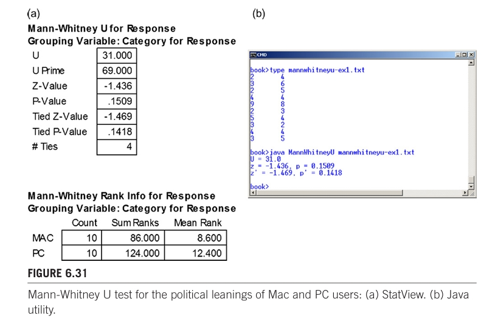

# Hypothesis Testing

在鸡尾酒会上，最好避免讨论宗教或政治。原因当然是人们对这些棘手话题的意见往往既强烈又分歧。让我们再加上统计学。几乎没有什么话题能比在实验研究中将统计技术应用于数据和假设更能引起争议了。幸运的是，读者并没有被卷入这场争论。相反，本章将描述并介绍人机交互研究中通常使用的一些有用的统计工具和技术。在接下来的篇幅中，我将努力将理论和争论最小化，同时将实用价值最大化。

假设检验的统计程序有两种：参数检验和非参数检验。本章将对这两种方法进行研究。它们的显著特点是：参数检验对来自概率分布（如正态分布或 t 分布）的数据进行检验，而非参数检验是 "无分布 "的，也就是说，它们对基础数据的分布不做任何假设。区分参数检验与非参数检验的有效方法是根据被检验数据的测量水平或尺度（Sheskin，2011 年，第 109 页；Siegel，1957 年，表 1）。图 6.1 举例说明。图中显示了第 4 章（见第 4.4.2 节）中讨论的四种测量尺度，其中比率数据最复杂，名义数据最不复杂。

参数检验适用于比率数据和区间数据，但最常用于比率数据。本章将详细讨论的方差分析（ANOVA）是最广泛使用的参数检验方法。 

在人机交互的实验研究中，比值数据通常是人类性能的测量值，如完成任务的时间、速度或准确性，或事件计数，如按键、手指弹动、视线移动或目标重入。非参数检验适用于任何规模的数据，尽管它们最常用于名义或序数数据。本章研究的非参数检验方法包括用于名义数据的卡方（χ2）检验和用于序数数据的曼惠尼 U 检验、威尔科克森符号秩检验、克鲁斯卡尔-瓦利斯检验和弗里德曼检验。通常，非参数检验使用的数据是名义类别、问卷回答、评级分数或量表评估。对于比率数据，非参数检验的使用很有限，我们将在本章稍后讨论。

由于非参数检验被认为与所有四个测量量表相关（见图 6.1 右栏），因此它们比参数检验更普遍适用。然而，根据功率标准，参数检验优于非参数检验。这是参数检验的强假设和强要求的副产品。只要假设得到合理的遵守，参数检验就有更大的能力（功率）在所进行的统计检验中得出正确的结论。

本章的大部分内容都是针对方差分析的。然而，大多数使用方差分析的研究人员对方差分析中 "F 检验 "的计算和假设了解甚少。这也没有关系。不过，了解检验的含义、如何进行检验以及如何解释和说明检验结果是非常重要的。因此，我们在这里采用的方法更像是教科书，而不是学术性的

##  6.1 Analysis of variance

方差分析或 F 检验是因子实验中进行假设检验的主要统计程序。大多数描述实验的人机交互研究论文都包含方差分析结果，给出 F 统计量、F 统计量的自由度以及相关的 P 值（稍后解释）。方差分析结果通常在括号中报告，以支持说明 检验结果是否具有统计学意义。

方差分析确定自变量（测试条件）是否对因变量（测得的反应）有显著影响。方差分析通过将因变量观测值的方差划分为可归因于方差的各个部分来确定。可归因的成分 "是测试条件（因子和水平）和参与者。如果一个因子在不同水平上的方差相对于所有其余方差（其他因子和参与者）较大，那么通常可以得出结论：该因子的显著特性--测试条件中的特征--导致了因变量测量结果的观测差异。如果是这样，就可以说该因素对因变量产生了具有统计学意义的影响。

根据实验设计的不同，方差分析有不同的设置方法。本讨论从具有两个测试条件的简单单因素设计开始。然后，我将讨论具有四个测试条件的单因素设计。如果有两个以上的测试条件，通常会使用事后比较检验，我也会举例说明。然后，我将讨论包含两个或更多因素的更复杂的设计，每个因素都有两个或更多水平。

最初的示例假定在受试者中分配测试条件。这意味着每个参与者都要接受某一因素所有水平的测试。有些设计的测试条件是在受试者之间分配的，即招募一组单独的参与者，并将其分配给每种测试条件。下面还给出了几个主体间方差分析的例子

### 6.1.1 Why analyze the variance?

我在前面提到，研究问题通常是比较性的。通常，研究的目的是比较两种或两种以上的界面或交互技术，以确定哪种更好。我所说的 "更好 "是指在一个或多个因变量上的优异表现，如任务完成时间、错误率、任务重试次数、退格键的按下次数、目标重试次数等。有趣的是，这项测试被称为方差分析，但我们更关心的是总体表现：

上面的问题指的是时间--观察和测量的总体、平均时间。平均值是针对多个用户的每个测试条件计算出来的，通常是针对一项代表性任务的多次试验计算出来的。在某些情况下，对一项任务进行多次试验是为了调查学习效果（见第 4 章，纵向研究），但使用多次试验的目的往往只是为了获得稳定和有代表性的测量结果。不过，我们感兴趣的是平均值的差异，而不是方差。请注意，上述研究问题固然重要，但所追求的统计问题根本不是问题。它是一个被称为 "零假设 "的陈述：

假设 "无差异"，这是一个合理的起点。方差分析对数据进行检验，以确定零假设为真（成立）或为假（被拒绝）的可能性。在大多数情况下，研究人员会设法拒绝零假设。按照惯例，统计上显著的结果意味着零假设为真的可能性很小。这种情况下的结论是：(a) 均值存在差异；(b) 差异在统计上显著；(c) 差异是由试验条件中的可区分特性造成的。让我们来看看如何做到这一点。

假设有这样一个实验：10 名参与者使用两种交互技术重复完成一项任务。交互技术可以是任何技术，例如使用鼠标和键盘。实验选择的任务既能代表常见的交互方式，又有可能暴露出内在的差异。鼠标与键盘交互的例子可能是在分层菜单中选择选项。在本讨论中，我将保持简单明了，将这两种技术分别称为方法 A 和方法 B。请记住，本实验只有一个因素（交互方法）和两个水平（方法 A 和方法 B）。

成绩是根据任务完成时间（以秒为单位）等因变量来衡量的，并计算出每个参与者在几次试验中的平均值。然后计算每种方法的平均值。图 6.2 中的条形图显示了这一假设实验的两个结果示例。

在图 6.2a 和图 6.2b 中，任务完成的平均时间相同；但是，标注的结果却大相径庭。在图 6.2a 中，平均值的差异在统计学上是显著的。这意味着观察到的差异很可能是真实的，是由于方法 A 和方法 B 的不同特性造成的。

在图 6.2b 中，平均值的差异在统计上并不显著。这意味着平均值的差异很可能是偶然造成的。没有合理的依据表明任何一种方法都比另一种方法快。再做一次测试，结果很可能相反。尽管解释大相径庭，但这两个例子似乎是一样的：方法 A 的任务完成时间为 4.5 秒，而方法 B 为 5.5 秒。答案就在于观察结果的差异性--方差。让我们仔细看看。

图 6.3a 给出了图 6.2a 中的模拟数据，即每位参与者使用每种方法完成任务的平均时间（以秒为单位），以及每种方法的总体平均值和标准偏差。图 6.3b 显示了相应的柱形图，并带有误差条。误差条显示平均值的 ±1 个标准差。在数学上，方差是标准偏差的平方；然而，在研究论文中，报告标准偏差更为常见，因为标准偏差和平均值的单位相同（本例中为 "秒"）。

对图 6.3a 中的数据进行方差分析的步骤取决于所使用的统计程序。尽管如此，结果还是与图 6.4 中的表格相似。
   
表中最重要的统计量是 "P 值"。这是在零假设成立的情况下获得观测数据的概率。概率低，说明根据零假设，不可能出现均值差异。高概率表明均值差异可能只是偶然因素造成的。当 p = 0.0121 时，有一个相当低的概率--小于 2%--即差异仅仅是一个偶然的结果。很有可能是一种或另一种方法的某些固有的显著特性造成了差异。请注意前一句中的 "造成 "一词。实验研究之所以如此有价值，原因之一就是可以得出因果关系的结论。

根据实验研究的惯例，统计学意义上的显著性要求 p 小于 0.05，即 20 分之 1 的概率。换句话说，我们认为零假设是成立的，除非有 20 分之 1 或更小的概率认为零假设是不成立的。除了概率，方差分析中的重要统计量还有 F 统计量（F 值，样本方差的比率）以及主效应（方法）和残差效应（方法 * 主体）的自由度。相关统计数据汇集成一份声明，宣布研究问题的结果。

图 6.5（F 四舍五入到三位有效数字）是假设实验的研究论文中可能出现的示例。请注意，图中没有精确引用概率。相反，p 被引用为小于集合 {.05，.01，.005，.001，.0005，.0001}中一个更保守的临界值。因此，p 被引用为 p < .05 而不是 p = .0121.6。

图 6.5 中的语言包括测试条件的均值和均值差异的说明。平均值的差异就是效应大小。在人机交互研究中，效果大小通常是通过给出均值和绝对差值（本例中为一秒）或相对差值来表达的。当然，效果大小是否具有实际意义并不在方差分析的范围之内。在研究论文中，F 统计量的格式往往很不规范，因此值得稍作停顿，观察一下图 6.5 中的 F 统计量：

+ 放在括号内

+ F 大写

+ p 为小写

+ F 和 p 为斜体

+ 等号两边的空格

+ 逗号后的空格

+ 小于号两侧空格

+ 自由度为下标、普通、较小的字体8

+ F 统计量为三或四位有效数字

+ P 统计量小数点前没有零（因为它被限制在 0 和 1 之间）

为完整起见，让我们来研究第二个例子，即图 6.2b 中的模拟。图 6.6 显示了数据和相应的带有误差条的柱形图。

如前所述，第二次模拟的结果在统计意义上并不显著。图 6.6b 中的大误差条就说明了这一点。方差分析以较高的 P 统计量值显示并证实了结果的不显著性。从图 6.7 中的 P 值可以看出，均值差异有 45% 的可能只是偶然结果。尽管平均值与第一次模拟相同，但参与者的表现差异很大，因此测试条件之间的平均值差异可能只是偶然造成的。例如，观察图 6.6a，8 号学员使用方法 A 在 1.2 秒内完成了任务，而 10 号学员则用了 6.6 秒。很明显，有一些情况超出了两种交互方法的解释能力。

在研究论文中，不显著的结果也需要报告。图 6.8 是第二个模拟的示例。请记住，非显著方差分析并不意味着零假设成立（即均值无差异）。不显著的方差分析只是表明证据不足以拒绝零假设： 零假设仍然成立。

对于不显著的结果，方差分析结果有两种报告方式。如果 F 小于 1，则效应不可能显著，此时用 "ns "代替 p，表示 "不显著"。

### 6.1.2 More than two test conditions

上例中的一个因子有两个水平（测试条件）。实际上，一个因子往往有两个以上的水平。虽然想法相似，但还是值得举例说明。图 6.9 给出了一个假定实验的数据和柱状图，该实验比较了四种用户界面或交互方法。数据是对因变量的观察和测量结果。

对数据进行方差分析，得出图 6.10 所示的表格。首先，我们可以看到 p 小于 0.05，这是公认的显著性临界值。简单地说，测试条件对因变量有显著影响（F3,45 = 4.95，p < .005）。括号中的相关统计数据与之前一样，均来自表格。本例中的自由度有所不同。如果 n 是测试条件的数量，m 是参与者的数量，那么测试条件引起的方差的自由度为 (n - 1)，测试条件 × 受试者引起的方差的自由度为 (n - 1)(m - 1)。

由于方差分析表中的 P 值为 0.0047，因此均值差异是偶然结果的概率小于 0.5%。这种差异很可能是由一种或多种测试条件的固有特性造成的。换句话说，测试条件对因变量的影响在统计学上是显著的。

###  6.1.3 Post hoc comparisons

图 6.10 中的方差分析仅表明，至少有一个均值与至少另一个均值存在显著差异。快速浏览图 6.9b 中的条形图，我们不禁要问，哪些测试条件与哪些其他测试条件不同。要确定这一点，需要进行事后比较检验。图 6.11 中的 Scheffé 检验就是一个例子。在四个测试条件中，可以进行六项比较。其中，只有 A-C 和 B-C 的比较是显著的。换句话说，测试条件 A 和 C 之间以及测试条件 B 和 C 之间的平均值有显著差异。

使用 Scheffé 事后分析的人机交互研究论文包括以下几篇： Chen 和 Chien，2005 年；Czerwinski 等人，1999 年；Fang、Chai 和 Ferreira，2009 年；Freeman、Norris 和 Hyland，2006 年；Kurihara、Vronay 和 Igarashi，2005 年；Kuzuoka、Kosaka 等人，2004 年。

### 6.1.4 Between-subjects designs

上述示例假定采用的是受试者内设计：每位受试者在所有测试条件（因子水平）下接受测试。虽然主体内设计在人机交互中最为常见，但主体间设计也有使用。在对任一设计的数据进行方差分析时，都必须正确设置分析，因为受试者内数据与受试者间数据的方差划分是不同的。

让我们以实验为例，看看左撇子和右撇子用户在使用手写笔添加 PDA 上的日历条目时的差异。根据屏幕布局的不同，左撇子用户在与显示屏右侧的部件交互时可能会发生遮挡。遮挡是否会影响性能？可能会。也可能不会。实验招募了 16 名参与者。手型是一个主体间因素，分为两个层次：左撇子和右撇子，前者有 8 名参与者，后者有 8 名不同的参与者。每位参与者都重复了几次 "添加日历条目 "任务。每位参与者完成任务的平均时间见图 6.12a。虽然研究论文中一般不提供此类表格，但此处提供的数据是为了说明主体间方差分析的组织方式。大多数方差分析应用程序都是在数据矩阵上运行的，矩阵的行数等于参与者的人数，因此图 6.12a 中的数据分为 16 行。 受试者之间的因子被标识为一列增加的名义数据。"L "和 "R "分别代表左撇子和右撇子。

图 6.12b 汇总了按手性分类的结果，而图 6.12c 则以条形图的形式展示了相同的信息，这可能会出现在研究论文中。 对图 6.12a 右两列的 16 × 2 矩阵进行方差分析。结果如图 6.13 所示。自由度分别为：(n - 1)为手感引起的方差，(m - n)为残差引起的方差。

由于图 6.13 中的 P 值大于 0.05，因此左撇子和右撇子之间的差异在统计上并不显著。尽管各组之间的差异约为 10%--左撇子为 22.0 秒，右撇子为 19.9 秒--但观察结果中仍存在相当大的差异。根据这一实验结果，我们认为零假设成立，并得出结论：左撇子和右撇子用户在被测系统上执行添加日历输入任务时没有性能差异。

### 6.1.5 Two-way analysis of variance

有两个自变量或两个因素的实验称为 "双向设计"。对于这类实验，方差分析要测试每个因素对因变量的主效应以及交互效应。显着的交互效应意味着各因素的组合影响或作用于因变量。让我们看看双向方差分析是如何揭示这些效应的。

如果一个实验有两个因素，那么为参与者分配条件就有三种可能。可能是两个因素都在受试者内部分配，也可能是两个因素都在受试者之间分配，还可能是一个因素在受试者内部分配，另一个因素在受试者之间分配。图 6.14 给出了一个假设实验的结果，两个因素都在被试内分配。这两个因素分别是设备和任务，前者有三个水平，后者有两个水平。例如，设备可以是鼠标、轨迹球和手写笔，而任务可以是点选和拖选。但这在这里并不重要。在本示例中，每位参与者都在一个简单的目标捕捉任务中接受了三种设备和两种任务的测试。在这种情况下，实验被称为 "3 × 2 被试内设计"。我们还假定，施测条件的顺序也以某种方式进行了平衡（见第 5 章第 5.11 节）。数据显示的是因变量 "任务完成时间 "的测量反应，单位为秒。

在图 6.14a 中，数据按参与者、设备和任务列出。显然，12 号学员使用设备 3 在 9 秒内完成了任务 2。最下面几行显示的是平均值和标准偏差，是 12 名参与者在每个设备-任务条件下的计算结果。图 6.14b 重新组织了数据，以更清楚地显示设备和任务的效果。如图所示，设备 3 速度最快，设备 1 速度最慢。任务 2 的执行速度略快于任务 1。图 6.14c 以条形图的形式显示了每个设备和任务的平均得分，这可能会出现在研究论文中。误差条显示平均值的 ±1 个标准差。

虽然三种设备和两种任务之间存在差异，但如图 6.14a 底行所示，反应也存在差异。因此，问题仍然是：观察到的差异是否显著，是否可归因于设备或任务的固有特性，或者这些差异只是偶然的结果？这个问题可以通过方差分析来回答。方差分析在图 6.14a 中的 12 × 6 核心矩阵上进行。在准备分析数据时，正确分配因子和水平非常重要。如图 6.14a 所示，列按设备排序，任务嵌套在设备中。结果如图 6.15 所示。

图 6.15 中有三个结果：设备主效应、任务主效应和设备与任务交互效应。让我们看看如何将这些结果从方差分析表中提取出来，并在研究论文中呈现。图 6.16 给出了一个例子。

在介绍统计结果时如何激发读者的兴趣是一项挑战。如果读者面对的是一个又一个乏味无趣的统计数字，他很快就会失去兴趣。报告结果的目的就是从实验研究中出现的大量数据中，有选择性地抽取出有趣的、有启发性的测量和统计结果。请注意图 6.16 中的表述，如 "差异不大"、"稍快 "和 "完全由于"。这些都是为了提高结果的可读性而做的小修饰。需要进一步讨论来解释结果（例如，"设备 3 在任务 2 中的性能提高归功于...."）。

当然，重要的是数据，而不是统计数据。统计检验有助于评估假设，但它们本身并不是结果。Day 和 Gastel（2006, 63）进一步强调了这一点："一般来说，对统计方法的冗长描述表明作者最近才获得这些信息，并认为读者也需要类似的启迪"。不要觉得必须解释方差分析或任何其他统计方法。根据数据给出结果，并简单明了地传达辅助统计检验，无需赘述

### 6.1.6 ANOVA tool

本书网站上有一个名为 Anova2 的 Java 工具。Anova2 是一个命令行应用程序，可以处理文本文件中的数据，并在控制台上生成一个方差分析表。该工具支持五种设计：

+ 单向，有一个被试内因子

+ 单向，带一个被试间因子

+ 具有两个被试内因子的双向设计

+ 带一个主体内因子和一个主体间因子的双向设计

+ 具有两个主体内因子和一个主体间因子的三向分析

为了说明 Anova2 的一般操作，图 6.17 显示了不带参数运行程序时的使用信息。

虽然应用程序接口提供了大量说明和示例，但这里只包含一个示例。文件 dix-example-10×2.txt 包含图 6.18 所示的数据。数据来自 Dix 等人（2004, 337）描述的图标识别假定实验。单因子 (F1) 是图标设计，分为自然和抽象两个层次。数据是任务完成时间（因变量）的测量值。第一列是自然图标的任务完成时间，第二列是抽象图标的任务完成时间。每行包含一名参与者的测量结果。假设实验有 10 名参与者

自然图标的平均任务完成时间（未显示）为 697.7 秒，抽象图标的平均任务完成时间为 750.3 秒。显然，自然图标的识别时间比抽象图标少 7.0%。通过方差分析可以确定这种差异是否具有统计学意义，或者是否可能是偶然造成的。该分析由命令行启动，并向控制台输出方差分析表。(见图 6.19）。

从表中可以看出，研究论文中可能会写道："实验表明，图标类型对任务完成时间有显著影响（F1,9 = 33.36，p < .0005）。

### 6.1.7 Counterbalancing and testing for a group effect

如前一章所述，如果在被试内分配一个因子，则必须抵消不同条件下的学习效果。最常见的方法是平衡。对于有两个水平（A 和 B）的单因素，这就需要把参与者分成两个相等的组。一组（G1）先测试 A，再测试 B；另一组（G2）先测试 B，再测试 A。这样做的目的是平衡或抵消任何学习效果。如果平衡起作用了，就不应该有群体效应，即 G1 和 G2 之间没有显著差异。很简单，但如何知道平衡起作用了呢？研究群体效应的方法是将群体视为主体间因素。当然，小组并不是研究课题意义上的因素。尽管如此，仍可将组作为被试间因子来组织数据，并通过方差分析来检验组效应--组对因变量的主效应。

我将通过修改上一节中的图标设计示例来说明这一点。由于设计是在被试内进行的，我们假定使用了平衡来抵消学习效应。10 名参与者分为两组，每组 5 人。一组先测试自然图标，然后测试抽象图标（NA）。另一组的测试条件顺序正好相反（AN）。修改后的数据如图 6.20 所示。受试者之间的组别标识符作为一列单独的名义数据出现。还添加了标题行。这是 Anova2 的可选功能，用于提高方差分析表的可读性。

为了进行方差分析，现在的实验是一个 2 × 2 设计，包含一个对象内因子（图标类型，包含自然和抽象两个水平）和一个对象间因子（组别，包含 NA 和 AN 两个水平）。使用 Anova2 对图 6.20 中的数据进行方差分析，使用相同的命令，只是指定了新文件，注意到存在两个水平的被试间因子，并包含表示存在标题行的 -h 选项。(见图 6.21。）从顶行可以看出，群体效应并不显著（F1,8 = 0.466，ns）。这是一个好消息。组间效应不显著意味着平衡起到了作用。任何可能发生的学习都被平衡掉了。尽管由于在计算方差时对数据进行了新的分区，F 值和 p 值略有不同，但实验的主要结果保持不变。结果仍然是图标类型对任务完成时间有显著影响（F1,8 = 30.68，p < .0005）。

图 6.21 中还有第三个效应。这是图标类型和组别之间的双向交互效应。从方差分析表中可以看出，该效应不显著（F1,8 = 0.277，ns）。如果该效应显著，则表示存在一种称为非对称技能转移的现象（Poulton，1974 年），即存在学习效应，而且从 A 过渡到 N 与从 N 过渡到 A 是不同的（见第 5 章第 5.12 节）。

在许多研究实验中，都会对受试者内部因素进行平衡，而不对群体效应进行实际测试。这在很大程度上是一种选择。有关方差分析的一些练习示例，请参阅本章末的学生练习。

##  6.2 Chi-square test

研究各种关系的常用统计程序是卡方检验，也称皮尔逊卡方检验，有时用 "平方 "代替 "方"。其发音为 kī（与 sky 押韵）。分类变量或名义变量之间的关系代表了人、交互方法、系统等的属性。数据通常以或然率表的形式进行汇总--或然率表是一种交叉表，将数据按行和列组织起来，每个单元格都包含该类别中观察结果数量的计数或频率数据。千方检验将观察值（表中的计数）与预期值进行比较。预期值是在假设表中类别之间没有差异的前提下得出的。卡方检验是一种非参数检验，因为类别是名义尺度属性，没有相关的概率分布。一个假设的例子可以说明这一点。

考虑开展一项研究项目，调查男性或女性在使用台式电脑系统时滚动的方法是否有所不同。为了研究这个问题，我们对大量用户进行了观察。对于每个用户，我们都会记录下他们是男性还是女性，以及他们是使用鼠标滚轮 (MW)、通过点击和拖动滚动条 (CD) 还是键盘 (KB) 进行滚动。分类为性别（男、女）和滚动方式（MW、CD、KB）。图 6.22a 以 2 × 3 或然率表的形式提供了数据。共观察到 1001 位用户，包括 56 位男性和 45 位女性。使用滚动方式的人数分别为 49 人（MW）、24 人（CD）和 28 人（KB）。图 6.22b 以条形图的形式显示了数据，这可能会出现在研究论文中。

浏览一下数据和图表就会发现，男性和女性在台式电脑上滚动的方法可能确实存在差异。只有 9 位女性使用点击和拖动，而男性则有 15 位。不过，总体上观察到的男性更多，因此差异并没有想象中那么大。那么，问题在于观察到的差异是真实存在的，还是仅仅是随机效应造成的。为了确定这一点，我们使用了卡方检验。检验统计量用希腊文小写字母 chi 表示，写作 χ2。与方差分析一样，检验的基本假设是 "无差异"，目的是拒绝该假设。但与方差分析不同的是，卡方检验非常简单。使用电子表格应用程序就可以轻松完成计算。让我们来详细了解一下这个例子。

卡方检验是观察值与期望值之间的比较，期望值考虑了不同的行列总数。图 6.23a 显示了图 6.22a 中数据在无差异假设下的期望值。每个预期值都是行总计乘以列总计，再除以总计。例如，男性-兆瓦预期值为 (56 × 49) / 101 = 27.2。如图 6.23b 所示，根据观察值和预期值，创建一个卡方表。每个卡方是（观测值减去预期值）除以预期值的平方。例如，男性-女性的卡方为 (28.0 - 27.2)2 / 27.2 = 0.025。

最终的卡方值是表中各个卡方的总和。对于示例数据，结果为 χ2 = 1.462，如图 6.23b 中右下角单元格所示。要确定单元格条目之间是否存在统计意义上的显著差异，需要将最终的卡方与临界值表中的值进行比较。如果卡方超过临界值，则或然表中的差异具有统计意义，这意味着表中的名义量纲变量存在显著差异。还需要两个细节：(a) 自由度，(b) 显著性所需的α 值或 p 值。卡方统计的自由度为 (r - 1)(c - 1)，其中 r 是行数，c 是列数。在本例中，df = (2 - 1) (3 - 1) = 2。α水平在测试前选定。本例使用 α = .05。显著性临界值可在表格中查找。在 α = .05 和 df = 2 时，临界值为 χ2 = 5.99。由于计算值 χ2 = 1.462 小于临界值，观察值的差异（见图 6.22）在统计上并不显著。因此，我们得出结论，男性和女性使用台式计算机系统的滚动方式没有差异。

为方便起见，本书网站提供了一个 ChiSquare Java 工具。它可以处理包含数据表的文本文件，数据表的行和列包含或然表中的计数。除了自动计算奇平方统计量 χ2 外，该实用程序还计算并输出概率 p，因此无需使用查找表。图 6.25 显示了实用程序对包含图 6.22a 中数据的文本文件的处理过程。

让我们再看一个例子，在这个例子中，结果具有统计学意义，并使用事后比较检验来确定哪些条件之间存在显著差异。

一名研究人员希望调查学生、教授和家长对课堂授课期间使用手机问题的回答是否一致。为此，研究人员随机抽取了大量学生、教授和家长，询问他们是否同意允许学生在课堂授课期间使用手机。调查分为观点（同意、不同意）和人物（学生、教授、家长）两类。总共抽样调查了 300 人，包括 40 名学生、60 名教授和 200 名家长。结果如下 120 人同意，180 人不同意。图 6.26 中的或然率表显示了按 "观点 "和 "人 "分类的数据。显而易见，受访者总体上认为不应该允许在课堂授课时使用手机。此外，三类人的回答方向一致。不过，仔细观察表格，我们会发现各类人之间存在一些差异。虽然不同意的学生比同意的学生多三倍，但不同意的家长比同意的家长只多几倍。为了确定回答的差异是否具有统计学意义，我们使用了卡方检验。

得出卡方统计量的计算方法与上一个例子相同。本例的结果是 χ2 = 20.5，df = 2。参照图 6.24，α = .05 (5.99) 和 α = .001 (13.82) 时的卡方统计量都超过了临界值。显然，学生、教授和家长对兴趣问题的看法存在差异。不过，由于有三类人，因此需要进行事后配对比较检验，以确定哪些类别的人之间存在差异。本书网站上的 ChiSquare 工具包括一个 -ph 选项，用于执行事后比较。(比较结果表明，1:3 和 2:3 的比较结果具有统计学意义（p < .05）。因此，在有关问题上，学生和家长之间以及教授和家长之间的意见存在差异。但是，学生和教授之间的意见没有差异。

最后，让我们用发表在 ACM SIGCHI 会议论文集上的一篇论文中的数据来举例说明。Ayyavu 和 Jensen 研究了帮助用户判断网站是否可信（不含垃圾邮件、掠夺者等）的工具（Ayyavu 和 Jensen，2011 年）。特别是，他们对基于社区的工具与基于启发式的工具所提供的评级之间的差异很感兴趣。他们研究了基于社区的工具 Web Of Trust（WOT）和基于启发式工具的 McAfee's Site Advisor（MSA）。他们向这些工具展示了 20,000 个网站，并对每个网站做出了好（安全）、坏（不安全）或不确定的评估。在剔除 WOT 或 MSA 给出不确定评级的网站后，还剩下 18,650 个网站。Ayyavu 和 Jensen 将这些地点的结果列在一个应急表中，格式如图 6.28 所示。值得庆幸的是，大多数地点都被认为是良好或安全的。WOT 将 9.21% 的地点评为差或不安全。而 MSA 的这一比例为 3.36%。这似乎是一个很大的差异。为了确定差异是否具有统计学意义，我们使用了卡方检验。结果为 χ2 = 543.5，df = 1。这远远高于 p < .05 的临界值 χ2 = 3.84（见图 6.24）。Ayyavu 和 Jensen 得出结论，这些工具提供的评估结果之间存在显著的统计学差异。事实上，他们报告说差异 "非常显著"，并指出卡方统计量超过了 p < .0001 临界值（Ayyavu 和 Jensen，2011 年，第 2309 页）。

在人机交互研究中，将或然率表与卡方检验相结合是研究关系的一种简单而有效的方法。这些关系通常是人的属性（男性与女性、Mac 用户与 PC 用户等）和他们的行为（如首选的滚动方式、发短信习惯等）之间的关系。但正如最后一个例子所示，属性也可能涉及系统和系统行为。以下是人机交互文献中关于卡方检验的其他几个例子： Bartneck、Verbunt、Mubin 和 Mahmud，2007；Kane、Wobbrock 和 Ladner，2011；Kindberg 等人，2008；Qvarfordt、Jönsson 和 Dahlbäck，2003）。另请参阅本章最后的学生练习 6-6 至 6-8。

## 6.3 Non-parametric tests for ordinal data

非参数检验不对获得基础数据的群体的概率分布做出假设。因此，与参数检验相比，非参数检验适用于更广泛的数据。不过，非参数检验也有缺点：信息丢失。参数检验（如方差分析）适用于区间或比率数据，而大多数非参数检验则适用于序数数据（等级）。非参数检验忽略了数据规模的任何属性，但通常性除外。如果被测数据实际上是区间或比率数据，非参数检验就会将差异归结为等级，从而浪费这一知识。例如，49、81、82（可能是学生的考试分数）这三个值被转换成 1、2、3。由于中间值现在与第一和第三个值的距离相等，因此显然牺牲了信息。非参数检验的好处是不受参数假设的约束，但却牺牲了利用所有可用信息拒绝虚假零假设的能力。

在接下来的示例中，将介绍人机交互研究中通常使用的非参数检验--分析序数（有时是区间）数据。这些数据通常通过问卷调查（如使用李克特量表）、偏好评级或量表评估获得。这些数据不是直接测量人的反应，而是从参与者那里主观获得，或使用启发式方法或其他非经验或半经验方法。

最常见的四种非参数检验方法是曼-惠特尼 U 检验、Wilcoxon Signed-Rank 检验、Kruskal-Wallis 检验和 Friedman 检验。根据检验条件的数量和实验设计的不同，每种方法都有其特定的使用场合。(如图 6.29 所示。）如图所示，主体间设计和主体内设计产生的数据分别来自独立样本和相关样本。主体间设计产生独立样本，因为每个条件都对不同的参与者进行测试。主体内设计会产生相关样本，因为每个条件都会对相同的参与者进行测试。请记住，条件是实验中单一自变量（因子）的水平。

下面通过一系列假设的例子来演示图 6.29 中的非参数检验。随着问题的描述和数据的呈现，哪种检验是合适的就会显现出来。由于克鲁斯卡尔-瓦利斯检验和弗里德曼检验是在三个或更多条件下进行的，因此在统计结果显著后，通常要进行事后配对比较检验。这一点也得到了证明。每个示例都提供了两个版本的数据分析。一个版本使用商业统计应用程序 StatView（现为 JMP）。另一个版本使用的是本书网站上提供的 Java 实用程序。两种分析的结果完全相同。让我们开始吧。

###  6.3.1 Example 1

一位研究人员试图确定 Mac 用户与 PC 用户的政治倾向是否存在差异。Mac 或 PC 用户的政治观点更倾向于左翼还是右翼？实验者随机抽取 10 名 Mac 用户和 10 名 PC 用户15 ，对他们进行访谈，并就他们的政治观点提出各种问题。每个参与者都要接受 10 分线性量表（1 = 非常左，10 = 非常右）的评估，评估结果以 10 行 2 列的表格形式存储在文件中。第一列是 Mac 用户的评估结果，第二列是 PC 用户的评估结果。数据见图 6.30

Mac 用户的平均得分为 3.7，PC 用户的平均得分为 4.5（未显示）。显然，PC 用户更 "右倾 "一些。但是，这种差异是真实存在的，还是仅仅是回答差异造成的假象？这些数据可能是区间尺度，但研究人员感觉到连续代码之间的区间并不相等，因为它们是基于定性评估的。数据至少是序数，因此选择非参数检验来回答这个问题。数据有两个条件，且分配是主体间的，因此合适的检验是 Mann-Whitney U 检验（见图 6.29）。使用 StatView（现在的 JMP）得到的结果如图 6.31a 所示，使用本书网站上的 MannWhitneyU Java 工具得到的结果如图 6.31b 所示。输出还包括归一化 z 分数（根据 U 计算）和 p，即在 "无差异 "的零假设下获得观察数据的概率。提供两个 z 值和 p 值。第二组包括 "并列校正"。在大多数情况下，与校正值的差异很小。

在本例中，U = 31.0，p = .1418（并列校正）。由于 p 大于 0.05，因此评估中的差异没有达到统计显著性的常规临界值。假设实验的结论是，Mac 用户和 PC 用户的政治倾向没有差异（U = 31.0，p > .05）

### 6.3.2 Example 2

一位研究人员有兴趣比较两种新设计的媒体播放器。他们特别想知道这两种设计对年轻用户的 "酷吸引力 "是否不同。研究人员招募了 10 名精通技术的年轻参与者，并给他们演示了这两种媒体播放器（MPA、MPB）。参与者被要求用 10 分线性量表（1 = 一点也不酷，10 = 非常酷）对设计的酷炫程度进行评分。数据见图 6.32。

媒体播放器 A 的平均评分为 6.4，媒体播放器 B 为 3.7（未显示）。与媒体播放器 B 相比，媒体播放器 A 的表现似乎相当不错。不过，回答中也存在一些差异，因此这种差异可能只是偶然的结果。为了检验评分差异是否真实，我们使用了统计检验。由于数据是区间尺度的（见例 1 的讨论），因此选择了非参数检验。测试条件有两个，且设计为非主体，因此采用 Wilcoxon Signed-Rank 检验是合适的（见图 6.29）。

使用 StatView 得到的结果如图 6.33a 所示，使用本书网站上的 WilcoxonSignedRank Java 工具得到的结果如图 6.33b 所示。Wilcoxon Signed-Rank 检验的检验统计量是归一化的 z 分数。在本例中，z = -2.254，p = .0242（并列校正）。由于 p 小于 0.05，因此超过了统计显著性的常规临界值。结论是两款媒体播放器在 "炫酷吸引力 "方面存在差异（z = -2.254，p < .05）

### 6.3.3 Example 3

一种新型汽车 GPS 系统的设计者想知道，年龄是否会成为影响产品接受度的一个因素。他们决定做一个小实验来找出答案。他们从 20-29 岁、30-39 岁和 40-49 岁三个年龄组各招募了八名参与者。实验人员向参与者演示了新的 GPS 系统，然后询问他们是否足够喜欢该系统，并考虑购买供个人使用。他们的回答采用 10 分线性量表（1=肯定不会，10=肯定会）。数据见图 6.34。

各年龄组的平均得分分别为 7.1 分（20-29 岁）、4.0 分（30-39 岁）和 2.9 分（40-49 岁）（未显示）。似乎存在差异，因为 20-29 岁年龄组的可接受性得分高于其他两个年龄组。不过，得分也存在一些差异。因此，问题仍然是：三个年龄组之间的可接受性得分差异是否具有统计学意义，或者这种差异仅仅是偶然的结果？由于数据是区间尺度的（见例 1 的讨论），因此选择非参数检验来帮助回答这个问题。有三个年龄组，且设计为受试者之间，因此采用 Kruskal-Wallis 检验是合适的（见图 6.29）。使用 StatView 得出的结果见图 6.35a，使用本书网站上的 KruskalWallis Java 工具得出的结果见图 6.35b。

检验统计量为 H，它服从奇平方分布，df = k - 1（k 为组数）。在本例中，H = 9.605，p = .0082（并列校正）。由于 p 低于统计显著性的常规临界值（.05），检验结果显示年龄组对 GPS 设计的可接受性有显著影响（χ2 = 9.605，p <.01，df = 2）。

有三个年龄组，因此需要进行事后配对比较检验，以确定哪些年龄组之间存在显著差异。17 （见图 6.36）显而易见，唯一有统计意义的成对比较是在成对 1 和 3 之间，即 20-29 岁组和 40-49 岁组之间。

###  6.3.4 Example 4

一位研究人员实现了四种不同的搜索引擎界面（A、B、C 和 D）。每个界面都使用不同的对话让用户建立查询。研究人员希望知道这些界面产生的结果质量是否不同。研究人员招募了八名参与者，向他们演示了每种界面，然后要求他们完成一系列搜索任务。对每个参与者和每个搜索引擎的 "结果质量 "进行评估。评估采用从 1 到 100 的线性量表（1 = 很差，100 = 很好）。使用拉丁方阵来平衡条件的顺序，但这在这里并不重要。数据见图 6.37。

从 A 到 D 的搜索引擎平均得分分别为 71.0、68.1、60.9 和 69.8（未显示）。最高分和最低分之间的差距只有 10 分左右，因此尚不清楚四个界面的搜索结果质量是否存在差异。尽管如此，仍值得测试是否存在显著差异。由于数据是区间尺度的（见例 1 的讨论），我们选择了非参数检验来进一步研究。有四种测试条件，而且条件是在被试内分配的，因此弗里德曼检验是合适的（见图 6.29）。使用 StatView 得出的结果如图 6.38a 所示，使用本书网站上的 Friedman Java 工具得出的结果如图 6.38b 所示。

弗里德曼检验统计量为 H，符合自由度为 n - 1 的卡方分布（n = 条件数）。如图所示，四个搜索引擎界面的搜索结果质量确实存在差异（χ2 = 8.692，p < .05，df = 3）。需要进行事后配对比较测试，以确定哪些搜索引擎界面之间存在显著差异。使用弗里德曼 Java 工具的 -ph 选项可以进行这种测试（见图 6.39）。有四个条件，就有六个成对比较。只有两个比较是显著的：1:3 和 3:4；即界面 C 和 A 之间以及界面 C 和 D 之间。

###  6.3.5 Discussion

在上述示例中，我们使用每个条件的平均值对数据进行了总结。这是人机交互研究中此类数据的常用方法。这也是有效的。由于评估尺度被描述为 "线性"，因此数据是区间尺度。

因此，平均值才是正确的中心倾向统计量。然而，许多人机交互实验使用的调查问卷中的回答项目都是以 Likertscale 或其他数字与语言标记的组合形式呈现的。由于回答项目受人为解释的影响，因此数据可能不是严格意义上的区间尺度（参见温度）。如果刻度是非线性的，那么数据的质量就会受到影响。在最坏的情况下，数据会退化为序数，而中心倾向的适当统计量是中位数（中间值）或模式（最常见值）。在一些研究论文中，使用平均值对问卷回答进行总结，而在其他论文中则使用中位数。在这个问题上，我们进入了一个灰色地带，研究人员对哪种测量方法是正确的测量方法持有不同的观点。有些人直截了当地声称，李克特量表的回答是顺序性的，报告平均值根本就是错误的（例如，Robertson，2012）。事实可能介于两者之间（即介于区间和序数之间）。

上述非参数检验仅限于单因素分析。例如，弗里德曼检验可以分析许多条件，但这些条件都是单因素的水平。该检验不能用于多因素分析，如 2 × 3 设计或 4 × 2 × 2 设计。(当然，参数方差分析也适用于多因素实验。）虽然有将非参数检验扩展到多因素实验的方法（Kaptein 等人，2010；Wobbrock、Findlater、Gergle 和 Higgins，2011），但这些工具对人机交互研究的价值有限。非参数检验最常用于分析问卷数据或评分，如上述例子。在多因素实验中，很少对每个条件进行问卷调查（如 4 × 2 × 2 = 16 次）。通常情况下，测试结束后只使用一份问卷，目的是收集参与者对测试条件的意见和偏好评分（可能是在多因素实验中）。在这种情况下，上面演示的非参数检验就可以了。一个可能的例外是对比率尺度数据使用非参数检验，我将在下一节讨论。

## 6.4 Parametric versus non-parametric tests

当有其他检验方法可用于研究实验中的数据时，就需要从各种可能性中做出选择。对于统计检验来说，指导原则是检验功率。统计能力是指提高对零假设的正确率：在应该拒绝零假设时拒绝它，而在没有（或没有足够）拒绝零假设的依据时不拒绝它。不过，还有其他问题需要考虑。西格尔（Siegel，1957 年）认为，适当的检验是检验的测量要求与研究中使用的测量相一致。在四种测量尺度--名义、序数、区间、比率（见第 4 章第 4.1.4 节）--中，配对很简单。如果研究数据是序数，那么对序数数据进行统计检验就是不错的选择。同样，如果实验数据是比率数据，那么对比率数据进行统计检验也是不错的选择。在人机交互领域，有一种常见的（也许还在不断增加的）做法与这一简单原则背道而驰。在有关人机交互研究中假设检验的最后一节中，我们将涉足本章导言中宣布为禁区的领域：争议。不过，我们的冒险将是短暂的。

参数检验（如方差分析）假定数据是从概率分布（如正态分布）中采样的。只要符合这一假设（还有其他一些假设），参数检验就比非参数检验具有更强的统计能力、更准确、更精确。但是，如果假设不符合，研究人员就必须决定采取适当的行动。有三种可能性：(1) 继续进行参数检验；(2) 以某种方式转换或清理数据以纠正违规情况，然后继续进行参数检验；或 (3) 使用非参数检验。这三种方法各有利弊。对可能违反基本假设的数据进行参数检验是一种常见的方法。出现这种情况的原因可能是研究人员不了解或无法获得检验假设的统计工具。此外，一些研究人员认为参数检验对违反假设的情况具有合理的稳健性，而且，无论如何，在分析真实数据时，基本假设很少得到满足（Erceg-Hurn 和 Mirosevich，2008 年）。特别担心违反假设的研究人员可能会选择后两种方案之一。然而，这两种方法都是有代价的。

使用对数或幂函数转换数据是纠正违反假设的有效方法。但正如西格尔所问："通过改变分数的数值来'归一化'分布的过程是否会导致所研究的实验效果失真？(西格尔，1957 年，第 14 页）。他指出，这是一个调查者可能无法回答的问题。Sheskin 补充道："人们可能会认为数据转换不过是一种'烹饪'数据的便捷机制，直到研究人员能够实现特定目标为止，"但他同时认为 "如果使用得当，数据转换可以成为一种有价值的工具"（Sheskin，2011 年，第 483 页）。因此，数据转换的问题是一个需要深入考虑的问题。第三种选择似乎在人机交互研究中越来越常见，那就是进行非参数测试。方便的是，这种方法回避了有关基础数据概率分布的问题。不过，对于可能是参数数据但违反假设的数据，我们不能轻易决定使用非参数检验。让我们进一步思考这一点。

对于顺序数据，如排名或量表上的定性评估，非参数检验是合理的选择。而对于比率数据，如人类绩效测量，参数检验则是首选，部分原因是参数检验具有更强的检验能力（能够拒绝错误的零假设），同时也因为参数检验与数据的配对是正确的这一简单标准。但是，比例尺度的人体性能测量符合参数数据的要求吗？换句话说，完成任务的时间或误差等测量值是否呈正态分布？这个问题的答案从来都不是精确的 "是"。数据是样本，因此继承了许多杂乱无章、甚至任性的倾向。如果期望样本能带来概率分布的精确特性，比如正态性，那么失望就会迫在眉睫。正态性、偏斜性等检验方法有很多，经验取样的小数据集经常会失败。如果数据是在实验中收集的因变量的测量值，研究人员可能会断定数据不是参数数据，然后进行非参数检验。但这可能是不必要或不明智的。回顾我们前面的讨论，非参数检验将数据分解为等级。正如 Sheskin 所说："当研究人员选择将一组区间/比率数据转化为等级数据时，信息就会被牺牲掉"（Sheskin, 2011, 第 531 页）。因此，对于偏离正态性的比率尺度测量，选择非参数检验就等于用一个缺陷代替另一个缺陷。建议保持克制。在实验研究中，为收集比率尺度的人类表现数据而设置的程序和工具不应该像将数据降级为序数（等级）那样被随意削弱。 让我们来探讨几个相关的问题。

20 世纪 50 年代和 60 年代初，社会科学中的应用统计广泛转向非参数检验。然而，正如格拉斯等人（1972 年）所指出的，放弃参数检验（主要是参数方差分析）而采用非参数检验在很大程度上是不必要的。之所以出现这种转变，是因为研究人员提出了一个错误的问题。他们问的是 "是否符合参数方差分析的假设？"而不是 "参数方差分析中不可避免的违反假设的后果是什么？" 这两个问题中的第一个很容易回答，因为对参数数据有许多 "假设检验"。然而，第二个问题却带来了巨大的挑战。

其一，当研究人员从根据确定的假设研究数学模型转向在违反假设的情况下研究同一模型时，严谨性标准必然会降低。要研究违反假设的后果，需要偏离假设的实证数据或模拟数据。这是一项艰巨而高度复杂的任务。但是，我们并不是一无所获。对这些问题已有大量研究（尽管不是在人机交互领域）。最后，有证据表明，参数方差分析对基本假设的违反具有合理的稳健性。即使样本量较小（如 n = 3），违反方差分析基本假设的后果通常也很轻微。让我们来看看人机交互研究中对比率尺度数据使用非参数检验的情况。

非参数检验，如 Mann-Whitney U、Wilcoxon Signed-Rank、Kruskal-Wallis 和 Friedman 检验，在人机交互文献中应用广泛。在大多数情况下，这些检验方法都用于调查问卷数据等。这很合适，因为数据是序数（或区间）数据。不过，也有对实验获得的比率数据使用非参数检验的例子。这种 
非参数检验的使用值得进一步研究。为了研究这个问题，我们使用人机交互文献中 25 篇出版物的样本进行了一次小型荟萃分析（见图 6.40）。(见图 6.40）通过研究这些例子，我们可以深入了解非参数检验在人机交互研究中的应用。

图 6.40 中的每个出版物示例都介绍了人机交互实验或用户研究的方法和结果。在每个案例中，自变量对因变量的影响都是通过非参数程序进行测试的。因变量是性能测量的比率尺度，因此可以使用参数检验。

因变量包括：任务完成时间（Ali、Scholer、Thom 和 Wu，2009 年；Gajos 等人，2008 年；Hayashi、Pendleton、Ozenc 和 Hong，2012 年；Huhtala、Karukka、Salminaa 和 Häkkilä，2011 年；Jacko 等人，2004 年；Kuzuoka、Yamazaki 等人，2004 年；J. Liu et al、 2010; Perugini, Anderson, and Moroney, 2007; Stanton, Kahn Jr., Severson, Ruckert, and Gill, 2008; Wilson, Brewster, Halvey, Crossan, and Stewart, 2011; Xiao et al、 2010；Hinckley、Baudisch、Ramos 和 Guimbretière，2005；Kane、Bigham 和 Wobbrock，2008；Seager 和 Fraser，2007；Wilson 等人，2011）、距离（Caniard 和 Fleming，2007；Rantanen、Verho、Lekkala、Tuisku 和 Surakka，2012）、信号强度（Solovey 等人，2012）以及点击次数（Farzam et al、 2008）、搜索源数量（J. Liu 等人，2010）、迷失方向数量（Seager 和 Fraser，2007）、碰撞数量（Solovey 等人，2012）、掉落物体数量（García、Molina、Gonzalez、Martínez 和 Martínez，2009）以及绘制元素数量（Sylla、Branco、Coutinho 和 Coquet，2009）。

为什么使用非参数检验？

在某些情况下，研究人员没有给出理由（Banovic 等人，2011；Elmqvist 等人，2008；Findlater 等人，2010；Hayashi 等人，2012；Hinckley 等人，2005；Kane 等人，2008；Kuzuoka、Yamazaki 等人，2004；Rantanen 等人，2012；Stanton 等人，2008；Wobbrock 等人，2009）。在其他情况下，研究人员对违反参数方差分析假设表示担忧。以下是导致选择非参数检验的解释样本： "时间数据不呈正态分布"（Ali 等人，2009 年，第 303 页）、"分布呈倾斜状"（Caniard 和 Fleming，2007 年，第 103 页）、"Shapiro-Wilk W 非正态性检验表明样本不可能来自正态分布"（Farzam et al、 2008，第 565 页）、"（数据）不符合正态性要求（Kolmogorov-Smirnov 检验）"（García 等人，2009，第 260 页）、"任务完成时间的分布明显不同于正态分布"（Perugini 等人，2007，第 968 页）以及 "数据不符合正态分布"（Wilson 等人，2011，第 150 页）。 

在所引用的论文中，没有一篇论文的研究人员对在比率数据上使用非参数检验所造成的信 息损失表示担忧。在摒弃参数检验时，这些研究人员关注的显然是前面提到的两个问题中的第一个：参数方差分析的假设是否满足？在 25 个例子中，只有两个例子额外考虑了第二个问题：违反假设的后果是什么？Munteanu 等人报告说

> 虽然我们对数据进行了正态性检验，但还进行了非参数（无分布）检验，即相关样本的 弗里德曼秩检验，并计算了卡方分数，以确认通过方差分析获得的 F 分数的有效性 （Munteanu, Baecker, Penn, Toms and James, 2006, p. 497）。

(Munteanu、Baecker、Penn、Toms 和 James，2006 年，第 497 页）

给出了参数检验和非参数检验的结果。结果表明，这两种检验得出了相同的结论。Perugini 等人报告说

> 由于任务完成时间的分布与正态分布有显著差异，我们还使用了曼-惠特尼 U 检验来进行非参数统计显著性检验。然而，由于方差分析和曼-惠特尼 U 检验的八项任务的显著差异模式（p < .05）相同，因此我们列出了方差分析的结果"。

(Perugini et al., 2007, p. 968)

在这两个例子中，我们都看到了一丝警示--使用非参数检验与参数检验之间存在问题。那么，哪种检验方法才是正确的检验方法呢？在此关头，建议使用参数检验（尽管违反了假设）或非参数检验（尽管损失了信息）对比率数据进行严格检验是不负责任的。可以说，由于参数检验更精确，统计能力更强，因此天平倾向于参数检验。不过，Munteanu 等人（2006 年）和 Perugini 等人（2007 年）的做法值得称赞：同时研究两种途径，考虑每种途径的结果，并注意可能出现的矛盾。